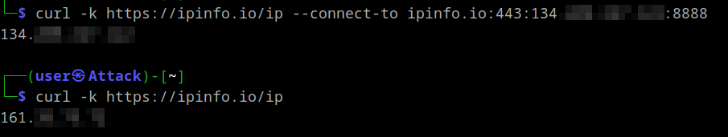
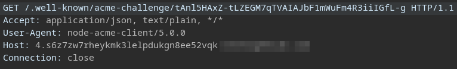

+++
title = 'TIL: SNI-Based Auto Certificate Generation Is a Thing'
date = 2024-08-31T15:44:45+02:00
+++

I recently stumbled upon a [great writeup](https://xybytes.com/azure/Azure-SSRF/) which explained how it is possible to get a SSRF from SNI to hit the Azure VM [Instance Metadata Service(IMDS)](https://learn.microsoft.com/en-us/azure/virtual-machines/instance-metadata-service?tabs=linux). Inspired, I started scanning for this behaviour within a [bug bounty scope](https://github.com/arkadiyt/bounty-targets-data). Not finding a single target, I proceeded to scan for the more "generic" finding of SNI based SSRF which yielded some interesting results.

To be honest, I did not even know that SNI SSRF is a thing, so let's start with that.

### SNI SSRF

As defined in [RFC 6066](https://datatracker.ietf.org/doc/html/rfc6066), Server Name Indication(SNI) is an extension to Transport Layer Security(TLS) allowing a client to indicate which hostname it is attempting to connect to at the start of the handshaking process.

After issuing an HTTPS request, we can see the SNI inside the `Client Hello` message:


Albeit on a lower level of the networking stack, SNI is somewhat similar to the HTTP `Host` header in that it instructs a server/reverse proxy about the intended destination. To play around with this, install nginx and configure the following:


```nginx {linenos=inline}
stream {
        log_format basic '$remote_addr [$time_local] $protocol $status $bytes_sent $bytes_received $session_time';
        access_log /var/log/nginx/access.log basic;

    server {
        listen 8888 ssl;
        resolver 8.8.8.8;
        proxy_pass $ssl_server_name:80;
        ssl_preread on;
        ssl_certificate ./ssl/MyCertificate.crt;
        ssl_certificate_key ./ssl/MyKey.key;
    }
}
```
(To use `stream` on Ubuntu you have to install it first with `sudo apt install libnginx-mod-stream`)

Set up certificates (content does not matter):
```bash
openssl ecparam -genkey -name secp384r1 -out MyKey.key \
openssl req -new -key MyKey.key -x509 -sha256 -days 365 -nodes -out MyCertificate.crt 
```

Test and apply config:
```bash
nginx -t 
nginx -s reload
```

Now you are able to trigger the SSRF with the following command:
```bash
curl -k https://example.com --connect-to example.com:443:<ip of nginx host>:8888
```

Example:


### Finding

Using the following [Nuclei](https://docs.projectdiscovery.io/tools/nuclei/overview) template I scanned for SNI-based SSRF in the [scope of several bug bounty programs](https://github.com/arkadiyt/bounty-targets-data).

```yaml
id: sni-ssrf

info:
  name: SNI Based SSRF
  author: flomb
  severity: medium

http:
  - raw:
    - |
      @tls-sni: {{interactsh-url}}
      GET / HTTP/1.1
      Host: {{Hostname}}
      Accept: */*

    matchers:
      - type: word
        part: interactsh_protocol
        words:
          - "http"
```

After I got a few matches, I tried to replicate them to see if there were any actual vulnerabilities:

```bash {linenos=inline}
curl -k --resolve <collaborator url>:443:$(dig learning.greensoluce.com +short| tail -1) https://<collaborator url> 
```
The results were quite surprising:




These responses hint at automatic TLS certificate issuance, with the second one clearly using the [ACME HTTP Challenge](https://datatracker.ietf.org/doc/html/rfc8555#section-8.3). Therefore, instead of SNI-based SSRF, I found servers that automatically requested a certificate for the requested SNI. 

*(The above example however was actually related to a SaaS vendor which allowed configuring a custom domain instead of `instance-id.vendor.com`)*

A quick search led me to the [caddy web server](https://caddyserver.com/), which [claims](https://caddyserver.com/docs/automatic-https#on-demand-tls) to be the first to offer this functionality. As this was entirely new to me, I wanted to try it out. All you would have to do is download caddy and start it with the following configuration.
```bash
caddy run --config caddyfile 
```

**Disclaimer: use this configuration only for testing purposes!**  
The [ACME protocol](https://datatracker.ietf.org/doc/html/rfc8555) ensures that you can not request certificates for domains you do not own, additionally, services like [Let's Encrypt](https://letsencrypt.org/) are rate-limited and you might therefore not be able to request a legitimate certificate after too many false attempts. For that reason Caddy requires you to configure restrictions when using `on_demand_tls`. This is implemented via the `ask` option, which is an endpoint to which Caddy will send an HTTP request to confirm the domain before attempting to issue a certificate.

In this example we configured Caddy itself to confirm these requests which would lead to the kind of behavior initially observed.


```caddy
{
    on_demand_tls {
            ask http://localhost:5555/
    }
}

http://localhost:5555 {
        respond 200
}

:443 {
    tls {
        on_demand
    }
    respond "Welcome to Caddy!"
}
```
