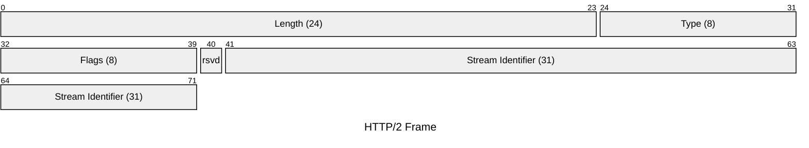
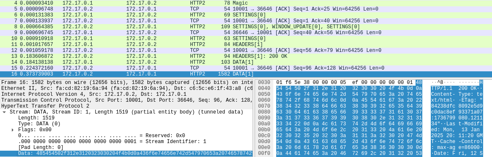
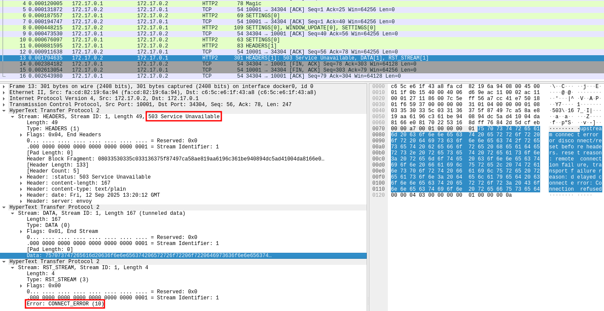

+++
title = 'Playing with HTTP/2 CONNECT'
date = 2025-09-15T14:55:23+02:00
+++

In HTTP/1, the [`CONNECT`](https://datatracker.ietf.org/doc/html/rfc9110#name-connect) method instructs a proxy to establish a TCP tunnel to a requested target. Once the tunnel is up, the proxy blindly forwards raw traffic in both directions. This mechanism is most commonly used to tunnel TLS traffic through forwarding proxies.

While digging through the HTTP/2 specification ([RFC 9113](https://datatracker.ietf.org/doc/html/rfc9113)), I noticed it also features the `CONNECT` method but with a slight twist.  Unlike its predecessor, HTTP/2 `CONNECT` doesn't hijack the entire TCP connection, it operates on a single stream. This subtle difference piqued my curiosity.

A typical HTTP/1 `CONNECT` request is straightforward:
```http
CONNECT google.de:443 HTTP/1.1 
Host: google.de:443 
User-Agent: curl/8.5.0 

```
Once the server responds with `HTTP/1.1 200 OK`, the tunnel is ready.  In essence, HTTP/1 `CONNECT` upgrades the entire TCP connection. Raw data is forwarded from that point on, making it seem as if the client is connected directly to the target.


HTTP/2, by contrast, is a binary protocol where the fundamental protocol unit is the frame. As shown below, every frame carries a stream identifier:

This stream identifier is used to simulate the HTTP/1 request and response pattern by associating each interaction with a unique stream. Streams allow multiplexing which means a single HTTP/2 connection can host multiple, simultaneous `CONNECT` tunnels. The raw data for each tunnel is then encapsulated within `DATA` frames on its respective stream.

To experiment with this, I decided to build a scanner for misconfigured proxies that allow connections to internal targets, leveraging multiplexing to efficiently scan a range of internal ports over a single TCP connection.

# Building a Scanner in Go

Go is currently my language of choice, and its standard library includes HTTP/2 support. While the high-level `net/http` client doesn't directly expose the `CONNECT` method for HTTP/2, the necessary building blocks are available in the `golang.org/x/net/http2` package.

First, we establish a raw TCP or TLS connection to the proxy. For TLS, we must negotiate HTTP/2 using ALPN by setting `NextProtos` to `h2`.
```go
// Note: All code snippets omit error handling for brevity.
conn, _ := tls.Dial("tcp", url.Host, &tls.Config{
    InsecureSkipVerify: true, 
    NextProtos:         []string{"h2"},
})
```

 To initiate the HTTP/2 connection, the client must send the [connection preface](https://datatracker.ietf.org/doc/html/rfc9113#section-3.4) (`PRI * HTTP/2.0\r\n\r\nSM\r\n\r\n`) followed by a, potentially empty, `SETTINGS` frame. The server replies with its own `SETTINGS` frame. Once both sides have acknowledged each other's settings, the connection is ready.

```go
conn.Write([]byte(http2.ClientPreface))
framer := http2.NewFramer(conn, conn)
framer.WriteSettings(http2.Setting{})
```

The `http2.Framer` handles the low-level work of parsing and serializing frames. Our main logic can be built around a loop that reads and processes incoming frames:
```go
for {
		f,_ := framer.ReadFrame()
		switch f := f.(type) {
		case *http2.DataFrame:
			// Handle incoming data for a tunnel
		case *http2.MetaHeadersFrame:
			// Handle response headers for a CONNECT request			
		case *http2.GoAwayFrame:
	       log.Println("Received GoAway frame")
	        return // Connection is closing
		case *http2.SettingsFrame:
			log.Printf("Received SETTINGS frame, ACK: %t\n", f.IsAck())
		case *http2.RSTStreamFrame:
			log.Printf("Received RST_STREAM frame for stream %d. Error: %s", f.StreamID, f.ErrCode)
		case *http2.PingFrame:
			log.Printf("Received frame: %v\n", f.FrameHeader.Type)	
		case *http2.WindowUpdateFrame:
			log.Printf("Received frame: %v\n", f.FrameHeader.Type)					
		default:
			log.Printf("Transport: unhandled response frame type %T", f)
		}
```

To create a tunnel, we send a `HEADERS` frame with the `CONNECT` method and set the `:authority` pseudo-header to our desired destination. Unlike HTTP/1's plaintext headers, HTTP/2 headers must be HPACK-encoded. This compression scheme saves bandwidth while also resisting compression oracle attacks like CRIME. HPACK uses a combination of a static table for common headers, a dynamic table that indexes repeated headers within the connection, and a static Huffman code for any remaining string literals. The initial static table and Huffman code are defined in the [specification](https://datatracker.ietf.org/doc/html/rfc7541#autoid-42).

```go
var hpackBuf bytes.Buffer
hpackEncoder := hpack.NewEncoder(&hpackBuf)

// Client-initiated streams MUST use odd-numbered stream identifiers.
streamID := uint32(1) 
targetAddress := "192.168.1.1:8080"

connectHeaders := []hpack.HeaderField{
    {Name: ":method", Value: "CONNECT"},
    {Name: ":authority", Value: targetAddress},
}

for _, hf := range connectHeaders {
    _ = hpackEncoder.WriteField(hf)
}

err := framer.WriteHeaders(http2.HeadersFrameParam{
    StreamID:      streamID,
    EndHeaders:    true,
    EndStream:     false, // Keep the stream open for data
    BlockFragment: hpackBuf.Bytes(),
})
```
If the proxy successfully establishes the tunnel, it will respond with a `HEADERS` frame containing a `:status 200`. From that point on, any `DATA` frames we send on that stream ID will be forwarded to the target, and any data from the target will be sent back to us in `DATA` frames on the same stream.

To make this stream usable in Go, we can wrap it in an object that satisfies the standard [`net.Conn`](https://cs.opensource.google/go/go/+/refs/tags/go1.25.1:src/net/net.go;l=124) interface. This allows us to treat our proxied tunnel just like any other network connection, such as one created with `net.Dial()`. The interface is defined as follows:

```go
type Conn interface {
	Read(b []byte) (n int, err error)
	Write(b []byte) (n int, err error)
	Close() error
	LocalAddr() Addr
	RemoteAddr() Addr
	SetDeadline(t time.Time) error
	SetReadDeadline(t time.Time) error
	SetWriteDeadline(t time.Time) error
}
```

An example implementation for the `Read` and `Write` methods might look like this:
```go
type tunnelConn struct {
	proxyConn *proxyConn 
	streamID  uint32
	rxChan    chan []byte
	rxBuff    bytes.Buffer
}

func (t *tunnelConn) Write(b []byte) (n int, err error) {
	err = t.proxyConn.framer.WriteData(t.streamID, false, b)
	return  len(b), err
}

func (t *tunnelConn) Read(b []byte) (n int, err error) {
	if t.rxBuff.Len() == 0 {
		data, ok := <-t.rxChan
		if !ok {
			return 0, io.EOF
		}
		t.rxBuff.Write(data)
	}
	return t.rxBuff.Read(b)
}
```

With this `net.Conn` implementation, we can easily layer other protocols on top. For instance, we could perform a TLS handshake and send an HTTP/1 request through the tunnel:
```go
tunnel, _ := proxyConn.getTunnelConn(ports, resultChan, "example.com", rxChan)

tlsClient := tls.Client(tunnel, &tls.Config{
    ServerName:         "example.com",
    InsecureSkipVerify: true,
})
fmt.Fprintf(tlsClient, "GET / HTTP/1.1\r\nHost: %s\r\n\r\n", "example.com")
```

Here is an example of the tool connecting to `example.com` through an HTTP/2 proxy:
```
└─$ ./http2ConnTun -u example.com -p 443 -c -k
2025/09/10 07:02:20 INFO Connected to proxy
HTTP/1.1 200 OK
Content-Type: text/html
ETag: "84238dfc8092e5d9c0dac8ef93371a07:1736799080.121134"
Last-Modified: Mon, 13 Jan 2025 20:11:20 GMT
Cache-Control: max-age=86000
Date: Wed, 10 Sep 2025 05:02:21 GMT
Content-Length: 1256
Connection: keep-alive
Alt-Svc: h3=":443"; ma=93600

<!doctype html>
<html>
<head>
    <title>Example Domain</title>

    <meta charset="utf-8" />
    <meta http-equiv="Content-type" content="text/html; charset=utf-8" />
    <meta name="viewport" content="width=device-width, initial-scale=1" />
    <style type="text/css">
    body {
...
```

The following Wireshark screenshot illustrates the full process, using a plaintext HTTP/1 request inside the tunnel for clarity:

1. The flow begins with the client preface, which Wireshark labels `Magic`.
2. We see the initial `SETTINGS` frames from the client and server, followed by `SETTINGS` frames with the `ACK` flag set, confirming receipt.
3. The client sends a `HEADERS` frame with the `CONNECT` method, and the server replies with a `HEADERS` frame indicating the result.
4. Finally, two `DATA` frames contain the plaintext HTTP/1 request and response sent through the established tunnel.

The full source code is available at https://github.com/fl0mb/HTTP2-CONNECT-Tunnel.

# Application: Efficient Port Scanning

With the underlying mechanics in place, building a port scanner is straightforward. Send out `CONNECT` requests for various `ip:port` combinations, each on a new stream ID. We don't even need to send `DATA` frames; we only need to monitor the response headers to determine if a port is open.

- A successful connection yields a `HEADERS` frame with a `:status 200`.

- As observed with Envoy and Apache httpd, a failed connection will typically result in:
  - A `HEADERS` frame with a `:status 503`.
  - A `DATA` frame from the proxy itself containing an error message.
  - A `RST_STREAM` frame with an error like `CONNECT_ERROR`(Envoy) or `NO_ERROR` (Apache). This is the most reliable indicator of failure. 



By tracking the responses for each stream ID, we can map out open ports on an internal network, all multiplexed over a single HTTP/2 connection. This technique may also bypass network security monitoring that isn't equipped to inspect multiplexed HTTP/2 traffic.

# Setting Up a Test Environment 

Support for HTTP/2 `CONNECT` tunneling is not  yet widespread. I found reliable implementations in Envoy and Apache httpd.

To run a test instance of Envoy, use the following Docker command:
```bash
docker run --rm -v ./envoy.yaml:/envoy.yaml:ro envoyproxy/envoy:distroless-v1.35-latest -c /envoy.yaml
```
`envoy.yaml`:
```yaml
static_resources:
  listeners:
  - name: listener_0
    address:
      socket_address:
        protocol: TCP
        address: 0.0.0.0
        port_value: 10001
    filter_chains:
    - filters:
      - name: envoy.filters.network.http_connection_manager
        typed_config:
          "@type": type.googleapis.com/envoy.extensions.filters.network.http_connection_manager.v3.HttpConnectionManager
          stat_prefix: ingress_http
          codec_type: HTTP2
          route_config:
            name: local_route
            virtual_hosts:
            - name: local_service
              domains:
              - "*"
              routes:
              - match:
                  connect_matcher:
                    {}
                route:
                  cluster: dynamic_forward_proxy_cluster
                  upgrade_configs:
                  - upgrade_type: CONNECT
                    connect_config:
                      {}
          http_filters:
          - name: envoy.filters.http.dynamic_forward_proxy
            typed_config:
              '@type': type.googleapis.com/envoy.extensions.filters.http.dynamic_forward_proxy.v3.FilterConfig
              dns_cache_config:
                name: dynamic_forward_proxy_cache_config
                dns_lookup_family: V4_ONLY                      
          http_filters:
          - name: envoy.filters.http.router
            typed_config:
              "@type": type.googleapis.com/envoy.extensions.filters.http.router.v3.Router
          http2_protocol_options:
            allow_connect: true
  clusters:
  - name: dynamic_forward_proxy_cluster
    lb_policy: CLUSTER_PROVIDED
    cluster_type:
      name: envoy.clusters.dynamic_forward_proxy
      typed_config:
        '@type': type.googleapis.com/envoy.extensions.clusters.dynamic_forward_proxy.v3.ClusterConfig
        dns_cache_config:
          name: dynamic_forward_proxy_cache_config
          dns_lookup_family: V4_ONLY
```

To run a test instance of Apache httpd:
```bash
docker run --rm -p 8080:8080 -v ./httpd.conf:/usr/local/apache2/conf/httpd.conf httpd:2.4.65
```

`httpd.conf`:
```apache
ServerRoot "/usr/local/apache2"
Listen 8080

LoadModule mpm_event_module modules/mod_mpm_event.so
LoadModule http2_module modules/mod_http2.so
LoadModule proxy_module modules/mod_proxy.so
LoadModule proxy_connect_module modules/mod_proxy_connect.so
LoadModule proxy_http_module modules/mod_proxy_http.so
LoadModule authz_core_module modules/mod_authz_core.so
LoadModule log_config_module modules/mod_log_config.so
LoadModule unixd_module modules/mod_unixd.so

<IfModule unixd_module> 
User daemon
Group daemon
</IfModule>

ErrorLog /dev/stderr
TransferLog /dev/stdout
ServerName localhost

<VirtualHost *:8080>
    ProxyRequests on
    Protocols h2c
    AllowCONNECT 443 80 8888
</VirtualHost>
```
# Conclusion 

HTTP/2's `CONNECT` method transforms a single connection into a conduit for multiple, independent tunnels. This offers a highly efficient way to multiplex connections, enabling applications like the port scanner demonstrated here. Because this traffic is encapsulated within a standard HTTP/2 stream, it may also bypass traditional network inspection tools.

While this post focused on TCP tunneling for port scanning, the `CONNECT` mechanism is being extended to support other protocols, opening up further possibilities.
- WebSockets: [RFC 8441](https://datatracker.ietf.org/doc/html/rfc8441) (Extended CONNECT) upgrades a stream to a WebSocket connection, bypassing the HTTP/1 `Connection: Upgrade` header, which is forbidden in HTTP/2. Example:
```http
:method: CONNECT
:authority: 172.17.0.1:8888
:protocol: websocket
:scheme: http
:path: /ws
sec-websocket-version: 13
```
- UDP: [RFC 9298](https://datatracker.ietf.org/doc/html/rfc9298) defines a method for proxying UDP datagrams.
- IP: [RFC 9484](https://datatracker.ietf.org/doc/html/rfc9484) specifies a way to proxy raw IP packets.

HTTP/2 does not appear to be widely known in the security community and I am looking forward to more interesting and creative applications.

For a more thorough introduction of HTTP/2, I recommend the series of blog posts on https://galbarnahum.com/.